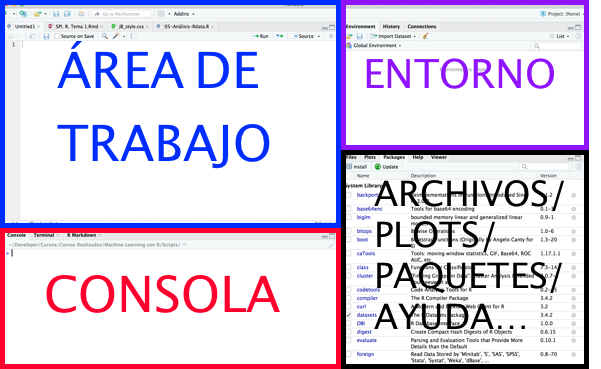
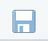
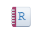
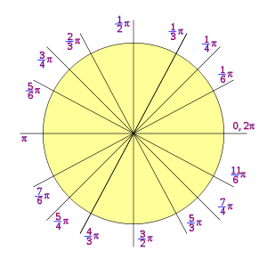
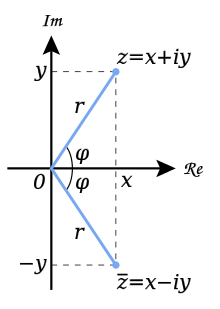

```{r setup, include=FALSE}
knitr::opts_chunk$set(echo = TRUE, comment = NA)
```
# Conociendo R


## ¿Qué es R?

<div class="aligncenter"> 
  
</div>


- Entorno de programación para el análisis estadístico y gráfico de datos
- Software libre
- Sintaxis sencilla e intuitiva
- Enorme comunidad de usuarios (Comprehensive R Archive Network, CRAN)
- ¿Aún tenéis dudas de por qué usarlo? [Haz click aquí](https://www.r-bloggers.com/why-use-r-five-reasons/)


## ¿Qué es RStudio?

En este curso usaremos RStudio como interfaz gráfica de usuario de R para todos los sistemas operativos

Es un entorno integrado para utilizar y programar con R

<div class="aligncenter"> 

</div> 


## Cómo instalar R

**Si sois de Windows o Mac**

1. Id a [CRAN](http://cran.r-project.org/)
2. Pulsad sobre el enlace correspondiente a vuestro sistema operativo
3. Seguid las instrucciones de instalación correspondientes

**Si trabajáis con Ubuntu o Debian**

1. Abrid la terminal, estando conectados a internet
2. Introducid lo siguiente: ```sudo aptitude install r-base```


## Cómo instalar RStudio

1. [Obtener RStudio](http://www.rstudio.com/products/rstudio/download/)
2. **Solo si utilizáis Linux**, ejecutad en una terminal la siguiente instrucción para completar la instalación: ```sudo dpkg -i rstudio-<version>-i386.deb```, donde ```version``` refiere a la versión concreta que se haya descargado

<div class="aligncenter">

</div>


## Trabajando con RStudio

<div class="aligncenter">






</div>
<div class = "aligncenter">

</div>

## Cómo pedir ayuda

- ```help()```: obtener ayuda por consola
- ```??...```: obtener ayuda por consola
- Pestaña ```Help``` de Rstudio
- [Cheat Sheet de RStudio](https://www.rstudio.com/wp-content/uploads/2015/02/rmarkdown-cheatsheet.pdf)
- Buscar en San Google (stackoverflow, R project...)
- Foro del curso

<div class="aligncenter">

</div>


## Paquetes: cómo instalarlos y cargarlos

<l class="definition">Paquete.</l> Librería con funciones y datos que no necesariamente vienen instaladas de serie 

- `install.packages("nombre_paquete", dep = TRUE)`: instala o actualiza un paquete de R
- ```library(nombre_del_paquete)```: carga un paquete ya instalado


# Utilizando R como calculadora

## Calculadora básica - Operaciones

Código |  Operación                                
--------------------|--------------------
```+``` | Suma
```-``` | Resta 
```*```  | Multiplicación
```/``` | División 
```^``` | Potencia 
```%/%``` | Cociente entero
``%%`` | Resto de división entera

## Calculadora básica - Operaciones

Código |  Significado                                 
--------------------|--------------------
```pi``` | [$\pi$](https://es.wikipedia.org/wiki/Número_π) 
`Inf` | [$\infty$](https://es.wikipedia.org/wiki/Infinito)
`NaN` | Indeterminación (Not a Number)
`NA` | Valor desconocido (Not Available)

## Calculadora básica - Operaciones

```{r}
2+2
77%/%5
77%%5
```

## Calculadora básica - Funciones 
Código |  Función                            
--------------------|--------------------
```sqrt(x)``` | $\sqrt{x}$
```exp(x)``` | $e^x$  
```log(x)``` | $\ln(x)$
```log10(x)``` | $\log_{10}(x)$
```log(x,a)``` | $\log_a(x)$ 
```abs(x)``` | $\begin{vmatrix}x\end{vmatrix}$

## Calculadora básica - Funciones

```{r}
sqrt(9)
log(exp(1))
log(1000,10)
log10(1000)
```


## Calculadora básica - Combinatoria

Código |  Operación                                 
--------------------|--------------------
```factorial(x)``` | [$x!$](https://es.wikipedia.org/wiki/Factorial)  
```choose(n,m)``` | $\begin{pmatrix}n\\ m\end{pmatrix}$   


\vspace{0.2cm}

- <l class="definition">Número factorial.</l> Se define como número factorial de un número entero positivo $n$ como $n!=n\cdot(n-1)\cdots 2\cdot 1$
- <l class="definition">[Coeficiente binomial](https://es.wikipedia.org/wiki/Coeficiente_binomial).</l> Se define el coeficiente binomial de $n$ sobre $m$ como $$\begin{pmatrix}n\\ m\end{pmatrix}=\frac{n!}{m!(n-m)!}$$

## Calculadora básica - Combinatoria

<l class="definition">[Triángulo de Pascal](https://es.wikipedia.org/wiki/Triángulo_de_Pascal).</l>
\usepackage{mathdots}
\usepackage{yhmath}
\usepackage{mathdots}
\usepackage{MnSymbol}
$$\begin{matrix}
&&&&&1&&&&&\\
&&&&1&&1&&&&\\
&&&1&&2&&1&&&\\
&&1&&3&&3&&1&&\\
&1&&4&&6&&4&&1&\\
1&&5&&10&&10&&5&&1\end{matrix}$$

que se corresponde con ...

## Calculadora básica - Combinatoria

$$\begin{matrix}
&&&&\begin{pmatrix}0\\0\end{pmatrix}&&&&\\
&&&\begin{pmatrix}1\\0\end{pmatrix}&&\begin{pmatrix}1\\1\end{pmatrix}&&&\\
&&\begin{pmatrix}2\\0\end{pmatrix}&&\begin{pmatrix}2\\1\end{pmatrix}&&\begin{pmatrix}2\\2\end{pmatrix}&&\\
&\begin{pmatrix}3\\0\end{pmatrix}&&\begin{pmatrix}3\\1\end{pmatrix}&&\begin{pmatrix}3\\2\end{pmatrix}&&\begin{pmatrix}3\\3\end{pmatrix}&\\
\begin{pmatrix}4\\0\end{pmatrix}&&\begin{pmatrix}4\\1\end{pmatrix}&&\begin{pmatrix}4\\2\end{pmatrix}&&\begin{pmatrix}4\\3\end{pmatrix}&&\begin{pmatrix}4\\4\end{pmatrix}\end{matrix}$$

## Calculadora básica - Combinatoria

```{r}
factorial(5)
choose(4,2)
factorial(6)
factorial(5)*6
```

## Trigonometría en radianes

Código |  Función                                 
--------------------|--------------------
```sin(x)``` | $\sin(x)$
```cos(x)``` | $\cos(x)$
```tan(x)``` | $\tan(x)$
```asin(x)``` | $\arcsin(x)$
```acos(x)``` | $\arccos(x)$
```atan(x)``` | $\arctan(x)$

## Trigonometría en radianes

```{r}
sin(pi/2)
cos(pi)
tan(0)
```

## Trigonometría en radianes

<div class = "aligncenter">

</div>

## Un pequeño adelanto

```{r, fig.height = 3.5, fig.width = 5, fig.align = "center"}
x = seq(0,2*pi,0.1)
plot(x,sin(x),type="l",col="blue",lwd=3, xlab=expression(x), ylab="")
lines(x,cos(x),col="green",lwd=3)
lines(x, tan(x), col="purple",lwd=3)
legend("bottomleft",col=c("blue","green","purple"),
     legend=c("Seno","Coseno", "Tangente"), lwd=3, bty="l")
```


## Números en coma flotante

Código |  Función                                 
-------|--------------------
```print(x,n)``` | Muestra las $n$ cifras significativa del número $x$
```round(x,n)``` | Redondea a $n$ cifras significativas un resultado o vector numérico $x$
```floor(x)``` | $\lfloor x\rfloor$, parte entera por defecto de $x$
```ceiling(x)``` | $\lceil x\rceil$, parte entera por exceso de $x$
```trunc(x)``` | Parte entera de $x$, eliminando la parte decimal


## Números en coma flotante

```{r}
print(pi,5)
round(pi,5)
floor(pi)
ceiling(pi)
```


## Variables y funciones

- `nombre_variable = valor`: define una variable con dicho valor
- `nombre_función = function(variable){función}`: define una función

```{r}
miVariable = 4
doble = function(x){2*x}
doble(miVariable)
cuadrado = function(x){x^2}
cuadrado(miVariable)
```


## Números complejos

Código |  Función                                 
--------------------|--------------------
 ```a+bi``` | [Número complejo](https://es.wikipedia.org/wiki/Número_complejo)
```complex(real=...,imaginary=...)``` | Número complejo en forma binómica
```complex(modulus=...,argument=...)``` | Número complejo en forma polar

## Números complejos

Código |  Función                                 
--------------------|--------------------
```sqrt(as.complex(-x))``` | $\sqrt{-x}$
```Re(x)``` | Parte real de $x$
```Im(x)``` | Parte imaginaria de $x$
```Mod(x)``` | Módulo de $x$
```Arg(x)``` | Argumento de $x$
``Conj(x)`` | Conjugado de $x$


## Números complejos

```{r}
z = 2+3i
z2 = complex(real = 2, imaginary = -3)
Re(z)
Im(z)
Conj(z2)
```


## Números complejos

<div class="aligncenter">


</div>
