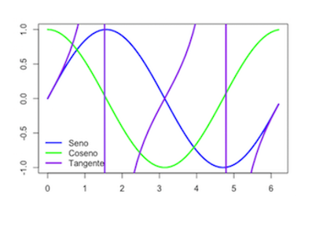

```{r setup, include=FALSE}
knitr::opts_chunk$set(echo = TRUE, comment = NA)
```
# Conociendo R


## ¿Qué es R?

<div class="aligncenter"> 
  
</div>


- Entorno de programación para el análisis estadístico y gráfico de datos
- Software libre
- Sintaxis sencilla e intuitiva
- Enorme comunidad de usuarios (Comprehensive R Archive Network, CRAN)
- ¿Aún tenéis dudas de por qué usarlo? [Haz click aquí](http://www.inside-r.org/why-use-r)


## ¿Qué es RStudio?

En este curso usaremos RStudio como interfaz gráfica de usuario de R para todos los sistemas operativos

Es un entorno integrado para utilizar y programar con R

<div class="aligncenter"> 

</div> 


## Cómo instalar R

**Si sois de Windows o Mac**

1. Id a [CRAN](http://cran.r-project.org/)
2. Pulsad sobre el enlace correspondiente a vuestro sistema operativo
3. Seguid las instrucciones de instalación correspondientes

**Si trabajáis con Ubuntu o Debian**

1. Abrid la terminal, estando conectados a internet
2. Introducid lo siguiente: ```sudo aptitude install r-base```


## Cómo instalar RStudio

1. [Obtener RStudio](http://www.rstudio.com/products/rstudio/download/)
2. **Solo si utilizáis Linux**, ejecutad en una terminal la siguiente instrucción para completar la instalación: ```sudo dpkg -i rstudio-<version>-i386.deb```, donde ```version``` refiere a la versión concreta que se haya descargado

<div class="aligncenter">

</div>


## Trabajando con RStudio


<div class = "aligncenter">

</div>

## Cómo pedir ayuda

- ```help()```: obtener ayuda por consola
- ```??...```: obtener ayuda por consola
- Pestaña ```Help``` de Rstudio
- Buscar en San Google (stackoverflow, R project...)
- Foro de la asignatura

<div class="aligncenter">

</div>


## Paquetes: cómo instalarlos y cargarlos

**Paquete**: librería con funciones y datos que no necesariamente vienen instaladas de serie 

- `install.packages("nombre_paquete", dep = TRUE)`: instala o actualiza un paquete de R
- ```library(nombre_del_paquete)```: carga un paquete ya instalado


# Utilizando R como calculadora

## Calculadora básica - Operaciones

- ```+```: suma
- ```-```: resta
- ```*```: multiplicación
- ```/```: división
- ```^```: potencia
- ```%/%```: cociente entero
- ``%%``: resto de división entera
- ```pi```: número $\pi$
- `Inf`: $\infty$
- `NaN`: indeterminación (Not a Number)
- `NA`: valor desconocido (Not Available)

## Ejemplo - Calculadora básica

```{r}
2+2
77%/%5
77%%5
```

## Calculadora básica - Funciones 

- ```sqrt(x)```: $\sqrt{x}$
- ```exp(x)```: $e^x$
- ```log(x)```: $\ln(x)$
- ```log10(x)```: $\log_{10}(x)$
- ```log(x,a)```: $\log_a(x)$
- ```abs(x)```: $|x|$

```{r}
sqrt(9)
```


## Calculadora básica - Combinatoria

- ```factorial(x)```: $x!$
- ```choose(n,m)```: $\begin{pmatrix}n\\ m\end{pmatrix}$

```{r}
factorial(5)
choose(4,2)
```


## Números en coma flotante

- ```print(x,n)```: muestra las $n$ cifras significativa del número $x$
- ```round(x,n)```: redondea a $n$ cifras significativas un resultado o vector numérico $x$
- ```floor(x)```: $\lfloor x\rfloor$, parte entera por defecto de $x$
- ```ceiling(x)```: $\lceil x\rceil$, parte entera por exceso de $x$
- ```trunc(x)```: parte entera de $x$, eliminando la parte decimal

```{r}
print(pi,7)
```


## Trigonometría en radianes

- ```sin(x)```: $\sin(x)$
- ```cos(x)```: $\cos(x)$
- ```tan(x)```: $\tan(x)$
- ```asin(x)```: $\arcsin(x)$
- ```acos(x)```: $\arccos(x)$
- ```atan(x)```: $\arctan(x)$

```{r}
cos(pi)
```


## Un pequeño adelanto

```{r}
x = seq(0,2*pi,0.1)
plot(x,sin(x),type="l",col="blue",lwd=3,
     xlab="", ylab="")
lines(x,cos(x),col="green",lwd=3)
lines(x, tan(x), col="purple",lwd=3)
legend("bottomleft",col=c("blue","green","purple"),
     legend=c("Seno","Coseno", "Tangente"), lwd=3, bty="n")
```
<div class="aligncenter">

</div>


## Variables y funciones

- `nombre_variable = valor`: define una variable con dicho valor
- `nombre_función = function(variable){función}`: define una función

```{r}
miVariable = 4
doble = function(x){2*x}
doble(miVariable)
cuadrado = function(x){x^2}
cuadrado(miVariable)
```


## Números complejos

- ```a+bi```: número complejo
- ```complex(real=...,imaginary=...)```: número complejo
- ```complex(modulus=...,argument=...)```: número complejo
- ```sqrt(as.complex(-x))```: $\sqrt{-x}$
- ```Re(x)```: parte real de $x$
- ```Im(x)```: parte imaginaria de $x$
- ```Mod(x)```: módulo de $x$
- ```Arg(x)```: argumento de $x$
- ``Conj(x)``: conjugado de $x$


## Ejemplo - Números complejos

```{r}
z = 2+3i
z2 = complex(real = 2, imaginary = -3)
Re(z)
Im(z)
Conj(z2)
```


## Ejercicio - R como calculadora {.exercise}

1. ¿Cómo es la sentencia del número $e$?
<!--exp(1)-->
2. Calculad con R $\log_41750$
<!--log(1750,4)-->
3. Calculad con R $\arctan{50}$ e imprimid solo 3 cifras significativas
<!--print(atan(50),3)-->
4. Cread una función que calcule el seno de un número multiplicado por la potencia al cubo de dicho número
<!--fun = function(x){sin(x)*x^3}-->
5. Cread una función que os resuelva una ecuación de primer grado (de la forma $Ax+B=0$). Es decir, vosotros tendréis que introducir como parámetros los coeficientes (en orden) y la función os tiene que devolver la solución. Por ejemplo, si la ecuación es $2x+4=0$, vuestra función os tendría que devolver $-2$.
<!--solu = function(A,B){-B/A}-->
6. Probad la función anterior para resolver $5x-3=17$
<!--solu(5,-20)-->


# Vectores

## Tipos de datos en R

- `logical`: lógicos (```TRUE``` o ```FALSE```)
- `integer`: números enteros, $\mathbb Z$
- `numeric`: números reales, $\mathbb R$
- `complex`: números complejos, $\mathbb C$
- `character`: palabras


## Vectores - Básico

- ```c()```: para definir un vector
- ```scan()```: para definir un vector
- ```fix(x)```: para modificar visualmente el vector $x$
- ```rep(a,b)```: para definir un vector constante que contiene el dato $a$ repetido $b$ veces

```{r}
c(1,2,3)
rep("Mates",7)
```


## Ejemplo - Función scan() {.example}

Vamos a crear un vector que contenga 3 copias de 1 9 9 8 0 7 2 6 con la función scan:
<div class = "aligncenter">

</div>


## Ejercicio - Vectores {.exercise}

1. Repite tu año de nacimiento 10 veces
<!--rep(miAño,10)-->
2. Crea el vector que tenga como entradas $16, 0, 1, 20, 1, 7, 88, 5, 1, 9$, llámalo vec y modifica la cuarta entrada con la función fix()
<!--vec = c(16,0,1,20,1,7,88,5,1,9), fix(vec)-->
<!--vec = scan(), 16 0 1 20 1 7 88 5 1 9, fix(vec)-->

EXTRA

3. Cread una función que os devuelva la parte real, la imaginaria, el módulo, el argumento y el conjugado de un número, mostrando solo 2 cifras significativas
<!--info = function(x){print(c(Re(x),Im(x),Mod(x),Arg(x),Conj(x)),2)}-->
4. Cread una función que resuelva ecuaciones de segundo grado (de la forma $Ax^2+Bx+C=0$). No importa, por ahora, que tengáis en cuenta las que no tienen solución
<!--solu2 = function(A,B,C){c((-B+sqrt(B^2-4*A*C)/2),(-B-sqrt(B^2-4*A*C)/2))}-->

RECOMENDACIÓN: En algún momento os hará falta utilizar vectores


## Vectores - Secuencias

- ``seq(a,b,by=d)``: para generar una [progresión aritmética](https://es.wikipedia.org/wiki/Progresión_aritmética) de diferencia $d$ que empieza en $a$ hasta llegar a $b$
- ```seq(a,b, length.out=n)```: define progresión aritmética de longitud $n$ que va de $a$ a $b$ con diferencia $d$. Por tanto $d=(b-a)/(n-1)$
- ```seq(a,by=d, length.out=n)```: define la progresión aritmética de longitud $n$ y diferencia $d$ que empieza en $a$
- ```a:b```: define la secuencia de números **enteros** ($\mathbb{Z}$) consecutivos entre dos números $a$ y $b$


## Ejercicio - Vectores {.exercise}

1. Imprimid los números del 1 al 20
<!--1:20 -->
2. Imprimid los 20 primeros números pares
<!--seq(2,by=2, length.out=20)-->
3. Imprimid 30 números equidistantes entre el 17 y el 98, mostrando solo 4 cifras significativas
<!--print(seq(17,98, length.out=30),4)-->


## Vectores - Funciones

- ```sapply(nombre_de_vector,FUN=nombre_de_función)```: para aplicar dicha función a todos los elementos del vector
- ```sqrt(x)```: calcula un nuevo vector con las raíces cuadradas de cada uno de los elementos del vector $x$
- ```length(x)```: calcula la longitud del vector $x$
- ```max(x)```: calcula el máximo del vector $x$
- ```min(x)```: calcula el mínimo del vector $x$
- ```sum(x)```: calcula la suma de las entradas del vector $x$
- ```prod(x)```: calcula el producto de las entradas del vector $x$


## Vectores - Funciones

- ```mean(x)```: calcula la media aritmética de las entradas del vector $x$
- ```diff(x)```: calcula el vector formado por las diferencias sucesivas entre entradas del vector original $x$
- ```cumsum(x)```: calcula el vector formado por las sumas acumuladas de las entradas del vector original $x$
	- Permite definir sucesiones descritas mediante sumatorios
	- Cada entrada de ``cumsum(x)`` es la suma de las entradas de $x$ hasta su posición
	

## Ejemplo - Vectores

```{r}
v = c(1,2,3,4,5,6)
sapply(v, FUN = cuadrado)
mean(v)
cumsum(v)
```


## Vectores - Orden

- ```sort(x)```: ordena el vector en orden natural de los objetos que lo forman: el orden numérico creciente, orden alfabético...
- ```rev(x)```: invierte el orden de los elementos del vector $x$

```{r}
v = c(1,7,5,2,4,6,3)
sort(v)
rev(v)
```


## Subvectores

- ```vector[i]```: da la $i$-ésima entrada del vector

	- Los índices en R empiezan en 1
	- ```vector[length(vector)]```: nos da la última entrada del vector
	- ```vector[length(vector)-i]```: nos da la $(i+1)$-ésima entrada del vector
	- ```vector[-i]```: si $i$ es un número, este subvector está formado por todas las entradas del vector original menos la entrada $i$-ésima. Si $i$ resulta ser un vector, entonces es un vector de índices y crea un nuevo vector con las entradas del vector original,cuyos índices pertenecen a $i$
	- ```vector[-i]```: si $i$ es un vector (de índices), entonces este es el complementario de vector[$i$]
	

## Subvectores

- También podemos utilizar operadores lógicos:
	
	- ```==```: =
	- ```!=```: $\neq$
	- ```>=```: $\ge$  
	- ```<=```: $\le$
	- ```<```: $<$
	- ```>```: $>$
	- ```!```: NO lógico
	- ```&```: Y lógico
	- ```|```: O lógico
	
	
## Ejemplo - Subvectores

```{r}
v = c(14,5,6,19,32,0,8)
v[2]
v[-c(3,5)]
v[v != 19 & v>15]
```
	
	
## Condicionales

- ```which(x cumple condición)```: para obtener los índices de las entradas del vector $x$ que satisfacen la condición dada
- ```which.min(x)```: nos da la primera posición en la que el vector $x$ toma su valor mínimo
- ```which(x==min(x))```: da todas las posiciones en las que el vector $x$ toma sus valores mínimos
- ```which.max(x)```: nos da la primera posición en la que el vector $x$ toma su valor máximo
- ```which(x==max(x))```: da todas las posiciones en las que el vector $x$ toma sus valores máximos


## Ejercicio - Subvectores {.exercise} 

1. Tomando el vector vec = c(0,9,98,2,6,7,5,19,88,20,16,0), dad 3 opciones diferentes para calcular el subvector c(9,19,20,16)
<!--vec[c(2,8,10,11)]-->
<!--vec[vec == 9 | vec == 19 | vec == 20 | vec == 16]-->
<!--vec[vec >= 9 & vec <= 20]-->
2. Tomando el vector vec definido en el apartado anterior, buscad 
    - qué entradas son pares
<!--which(vec%%2==0)-->
    - qué entradas no son pares y mayores que 20
<!--which(vec%%2!=0 & vec>20)-->
    - dónde toma vec su valor máximo
<!--which.max(vec)-->
    - dónde toma vec sus valores mínimos
<!--which(vec==min(vec))-->


# Factores

## Factor

**Factor**: es como un vector, pero con una estructura interna más rica que permite usarlo para clasificar observaciones

- `levels`: atributo del factor. Cada elemento del factor es igual a un nivel. Los niveles clasifican las entradas del factor. Se ordenan por orden alfabético
- Para definir un factor, primero hemos de definir un vector y trasformarlo por medio de una de las funciones `factor()` o `as.factor()`.

## La función factor()

- `factor(vector,levels=...)`: define un factor a partir del vector y dispone de algunos parámetros que permiten modificar el factor que se crea:
  
    - `levels`: permite especificar los niveles e incluso añadir niveles que no aparecen en el vector
    - `labels`: permite cambiar los nombres de los niveles
    
-  `levels(factor)`: para obtener los niveles del factor


## Factor Ordenado

**Factor ordenado**: Es un factor donde los niveles siguen un orden

- `ordered(vector,levels=...)`: función que define un factor ordenado y tiene los mismos parámetros que factor


## Ejemplo - Factores

```{r}
fac = factor(c(1,1,1,2,2,3,2,4,1,3,3,4,2,3,4,4), 
       levels = c(1,2,3,4), labels = c("Sus","Apr","Not","Exc"))
fac
facOrd = ordered(c(1,1,1,2,2,3,2,4,1,3,3,4,2,3,4,4), 
       levels = c(1,2,3,4), labels = c("Sus","Apr","Not","Exc"))
facOrd
```


# Lists

## List

**List**: Lista formada por diferentes objetos, no necesariamente del mismo tipo, cada cual con un nombre interno

- `list(...)`: función que crea una list
    - Para obtener una componente concreta usamos la instrucción `list$componente`
    - También podemos indicar el objeto por su posición usando dobles corchetes: `list[[i]]`. Lo que obtendremos es una list formada por esa única componente, no el objeto que forma la componente


## Obtener información de una list

- `str(list)`: para conocer la estructura interna de una list
- `names(list)`: para saber los nombres de la list


## Ejemplo - List

```{r}
x = c(1,-2,3,4,-5,6,7,-8,-9,0)
miLista = list(nombre = "X", vector = x, 
               media = mean(x), sumas = cumsum(x))
miLista
```


## Ejemplo - List

```{r}
str(miLista)
names(miLista)
```


# Matrices

## Matrices - Cómo definirlas

- `matrix(vector, nrow=n, byrow=valor_lógico)`: para definir una matriz de $n$ filas formada por las entradas del vector
    - `nrow`: número de filas
    - `byrow`: si se iguala a TRUE, la matriz se construye por filas; si se iguala a FALSE (valor por defecto), se construye por columnas.
    -` ncol`: número de columnas (puede usarse en lugar de nrow)
    - R muestra las matrices indicando como [$i,$] la fila $i$-ésima y [$,j$] la columna $j$-ésima
	- Todas las entradas de una matriz han de ser del mismo tipo de datos
	

## Ejercicio - Matrices {.exercise}

- ¿Cómo definirías una matriz constante? Es decir, ¿cómo definirías una matriz $A$ tal que $\forall\  i=1,...,n; j = 1,...,m$, $a_{i,j}=k$ siendo $k\in\mathbb{R}$? Como R no admite incógnitas, prueba para el caso específico $n = 3, m = 5, k = 0$
<!-- matrix(0, nrow = 3, ncol = 5)-->

- Con el vector vec = (1,2,3,4,5,6,7,8,9,10,11,12) crea la matriz 
$$\begin{pmatrix}
1 & 4 & 7 & 10\\
2 & 5 & 8 & 11\\
3 & 6 & 9 & 12
\end{pmatrix}$$
<!--matrix(vec, ncol = 4)-->


## Matrices - Cómo construirlas

- `rbind(vector1, vector2, ...)`: construye la matriz de filas vector1,  vector2,...
- `cbind(vector1, vector2, ...)`: construye la matriz de columnas vector1,  vector2,...
    - Los vectores han de tener la misma longitud
    - También sirve para añadir columnas (filas) a una matriz o concatenar por columnas (filas) matrices con el mismo número de filas (columnas)
- `diag(vector)`: para construir una matriz diagonal con un vector dado
    - Si aplicamos diag a un número $n$, produce una matriz identidad de orden $n$


## Submatrices

- `matriz[i,j]`: indica la entrada ($i,j$) de la matriz, siendo $i,j\in\mathbb{N}$. Si $i$ y $j$ son vectores de índices, estaremos definiendo la submatriz con las filas pertenecientes al vector $i$ y columnas pertenecientes al vector $j$
- `matriz[i,]`: indica la fila $i$-ésima de la matriz, siendo $i\in\mathbb{N}$
- `matriz[,j]`: indica la columna $j$-ésima de la siendo $j\in\mathbb{N}$
    - Si $i$ ($j$) es un vector de índices, estaremos definiendo la submatriz con las filas (columnas) pertenecientes al vector $i$ ($j$)
    
    
## Matrices - Funciones

- `diag(matriz)`: para obtener la diagonal de la matriz
- `nrow(matriz)`: nos devuelve el número de filas de la matriz
- `ncol(matriz)`: nos devuelve el número de columnas de la matriz
- `dim(matriz)`: nos devuelve las dimensiones de la matriz
- `sum(matriz)`: obtenemos la suma de todas las entradas de la matriz
- `prod(matriz)`: obtenemos el producto de todas las entradas de la matriz
- `mean(matriz)`: obtenemos la media aritmética de todas las entradas de la matriz


## Matrices - Funciones 

- `colSums(matriz)`: obtenemos las sumas por columnas de la matriz
- `rowSums(matriz)`: obtenemos las sumas por filas de la matriz
- `colMeans(matriz)`: obtenemos las medias aritméticas por columnas de la matriz
- `rowMeans(matriz)`: obtenemos las medias aritméticas por filas de la matriz


## Ejemplo - Matrices

<div class="example">
Dada la matriz $$A = \begin{pmatrix}
1 & 4 & 7\\
2 & 5 & 8\\
3 & 6 & 9
\end{pmatrix}$$
</div>

```{r}
A = matrix(c(1,2,3,4,5,6,7,8,9), ncol = 3)
dim(A)
diag(A)
```


## Matrices - Función apply()

- `apply(matriz, MARGIN=..., FUN=función)`: para aplicar otras funciones a las filas o las columnas de una matriz
    - `MARGIN`: ha de ser 1 si queremos aplicar la función por filas; 2 si queremos aplicarla por columnas; o c(1,2) si la queremos aplicar a cada entrada
 
 
## Ejemplo - Función apply()

```{r}
apply(A, MARGIN = c(1,2), FUN = cuadrado)
apply(A, MARGIN = 1, FUN = sum)
apply(A, MARGIN = 2, FUN = sum)
```


## Matrices - Operaciones

- `t(matriz)`: para obtener la transpuesta de la matriz
- `+`: para sumar matrices
- `*`: para el producto de un escalar por una matriz
- `%*%`: para multiplicar matrices
- `mtx.exp(matriz,n)`: para elevar la matriz a $n$
    - Del paquete `Biodem`
		- No calcula las potencias exactas, las aproxima
- `%%`: para elevar matrices
    - Del paquete `expm`
		- No calcula las potencias exactas, las aproxima


## Ejercicio - Matrices {.exercise}

Observad qué ocurre si, siendo $A = \begin{pmatrix}
2 & 0 & 2\\
1 & 2 & 3\\
0 & 1 & 3
\end{pmatrix}$ y $B = \begin{pmatrix}
3 & 2 & 1\\
1 & 0 & 0\\
1 & 1 & 1
\end{pmatrix}$, realizamos las operaciones $A*B$, $A^2$ y $B^3$


## Matrices - Operaciones			
			
- `det(matriz)`: para calcular el determinante de la matriz
- `qr(matriz)$rank`: para calcular el rango de la matriz
- `solve(matriz)`: para calcular la inversa de una matriz invertible
    - También sirve para resolver sistemas de ecuaciones lineales. Para ello introducimos `solve(matriz,b)`, donde $b$ es el vector de términos independientes
    
    
## Matrices - Valores y vectores propios

[Vector propio y valor propio](https://es.wikipedia.org/wiki/Vector_propio_y_valor_propio)

- `eigen(matriz)`: para calcular los valores (vaps) y vectores propios (veps)
    - `eigen(matriz)$values`: nos da el vector con los vaps de la matriz en orden decreciente de su valor absoluto y repetidos tantas veces como su multiplicidad algebraica.
    - `eigen(matriz)$vectors`: nos da una matriz cuyas columnas son los veps de la matriz.
    
## Ejemplo - Valores y vectores propios

```{r}
M = rbind(c(2,6,-8), c(0,6,-3), c(0,2,1))
eigen(M)
```


## Ejercicio - Valores y vectores propios {.exercise}

Comprobad, con los datos del ejemplo anterior, que si $P$ es la matriz de vectores propios de $M$ en columna y $D$ la matriz diagonal cuyas entradas son los valores propios de $M$, entoces se cumple la siguiente igualdad llamada **descomposición canónica**: $$M = P\cdot D\cdot P^{-1}$$


## Matrices - Valores y vectores propios

Si hay algún vap con multiplicidad algebraica mayor que 1 (es decir, que aparece más de una vez), la función `eigen()` da tantos valores de este vap como su multiplicidad algebraica indica. Además, en este caso, R intenta que los veps asociados a cada uno de estos vaps sean [linealmente independientes](https://es.wikipedia.org/wiki/Dependencia_e_independencia_lineal). Por tanto, cuando como resultado obtenemos veps repetidos asociados a un vap de multiplicidad algebraica mayor que 1, es porque para este vap no existen tantos veps linealmente independientes como su multiplicidad algebraica y, por consiguiente, la matriz no es [diagonalizable](https://es.wikipedia.org/wiki/Matriz_diagonalizable).


## Ejemplo - Valores y vectores propios

```{r}
M = matrix(c(0,1,0,-7,3,-1,16,-3,4), nrow=3, byrow=TRUE)
eigen(M)
```
    

# Ejercicios de Repaso Tema 1

## {.exercise}

- Si hubiéramos empezado a contar segundos a partir de las 12 campanadas que marcan el inicio de 2018, ¿a qué hora de qué día de qué año llegaríamos a los 250 millones de segundos? ¡Cuidado con los años bisiestos!
<!-- 250000000/60 = 4166667 minutos. 
     4166667%/%60 = 69444 horas y 4166667%%60 = 27 minutos
     69444%/%24 = 2893 días y 69444%%24 = 12 horas
     2893%/%365 = 7 años (de los cuales 2 son bisiestos) y (2893%%365)-2 = 336 días
     RESPUESTA: Estaríamos en el día 336 del año 2025 (lo que equivale al 2 de diciembre de 2025) y serían exactamente las 12:27 a.m-->
- Dad una expresión para calcular $(2 + 7)\cdot 8 + \frac{5}{2} - 3^6 + 8!$ y a continuación, dad el resultado que habéis obtenido con R
<!--(2+7)*8+5/2-3^6+factorial(8) 39665.5-->
- Dad una expresión para calcular $3e-\pi$ y a continuación, dad el resultado que habéis obtenido con R redondeado a 3 cifras decimales
<!--round(3*exp(1)-pi,3) 5.013 -->
- Dad el módulo del número complejo $\frac{(2+3i)^2}{5+8i}$ redondeado a 3 cifras decimales
<!--round(Mod((2+3i)^2/(5+8i)),3) 1.378-->
- Crea un vector llamado "Harry" formado por la sucesión de números consecutivos entre el -10 y 27. Pedidle a R que os devuelva el elemento de índice 7. Escribid el resultado
<!--Harry=-10:27; Harry[7]; -4-->
- Dad el máximo de la sucesión $(100\cdot 2n -7\cdot 3n)_{0,...,200}$
<!--n=0:200; max(100*2^n-7*3^n); 1499 -->
- Cread la sucesión de números consecutivos entre 0 y 40. A continuación, cread la lista $(3\cdot 5n - 1)_{0,...,40}$. Ponedle como nombre `x`. Ahora, dad la sublista de los elementos que son estrictamente mayores que 3.5.
<!--n=0:40; x=3*5^n-1; which(x>3.5) -->


## {.exercise}

- Dad la entrada (2,2) de $A\cdot (A+A )\cdot A$, on $A = \begin{pmatrix} 1 & 3\\ 2 & 4\end{pmatrix}$
<!-- 240 -->
- Dad los valores propios de la matriz $B = \begin{pmatrix} 2 & 4 & -6\\ 0 & 0 & 3\\ 0 & -2 & 5\end{pmatrix}$
<!-- 3 2 2-->
- Dad, redondeando a 3 cifras decimales, los vectores propios de la matriz $C = \begin{pmatrix} -48 & 35 & -12\\ -134 & 95 & -32\\ -194 & 133 & -44\end{pmatrix}$
<!-- 0.371 0.743 0.557-->
- Dad el rango de la matriz $D = \begin{pmatrix} -2 & -8 & -2 & 3\\ -3 & -6 & -1 & 2\\ -9 & -22 & -3 & 7\\ -18 & -44 & -8 & 15\end{pmatrix}$
<!-- 3-->


			


