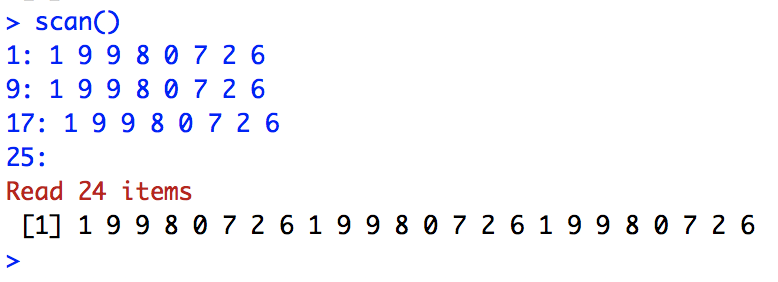

```{r setup, include=FALSE}
knitr::opts_chunk$set(echo = TRUE, comment = NA)
```

# Vectores

## Tipos de datos en R

Un **vector** es una secuencia ordenada de datos. `R` dispone de muchos tipos de datos, por ejemplo:

- `logical`: lógicos (```TRUE``` o ```FALSE```)
- `integer`: números enteros, $\mathbb Z$
- `numeric`: números reales, $\mathbb R$
- `complex`: números complejos, $\mathbb C$
- `character`: palabras

En los vectores de `R`, todos sus objetos han de ser del mismo tipo: todos números, todos palabras, etc. Cuando queramos usar vectores formados por objetos de diferentes tipos, tendremos que usar **listas generalizadas**, `lists` que veremos al final del tema.

## Básico

- ```c()```: para definir un vector
- ```scan()```: para definir un vector
- ```fix(x)```: para modificar visualmente el vector $x$
- ```rep(a,n)```: para definir un vector constante que contiene el dato $a$ repetido $n$ veces

```{r}
c(1,2,3)
rep("Mates",7)
```


## Función scan() {.example}

**Ejemplo**

Vamos a crear un vector que contenga 3 copias de 1 9 9 8 0 7 2 6 con la función scan:
<div class = "aligncenter">

</div>


## Básico {.exercise}


**Ejercicio**

1. Repite tu año de nacimiento 10 veces
<!--rep(miAño,10)-->
2. Crea el vector que tenga como entradas $16, 0, 1, 20, 1, 7, 88, 5, 1, 9$, llámalo vec y modifica la cuarta entrada con la función fix()
<!--vec = c(16,0,1,20,1,7,88,5,1,9), fix(vec)-->
<!--vec = scan(), 16 0 1 20 1 7 88 5 1 9, fix(vec)-->

<div class = "aligncenter">

</div>


## Progresiones y Secuencias

Una progresión aritmética es una sucesión de números tales que la **diferencia**, $d$, de cualquier par de términos sucesivos de la secuencia es constante.
$$a_n = a_1 + (n-1)\cdot d$$

- ``seq(a,b,by=d)``: para generar una [progresión aritmética](https://es.wikipedia.org/wiki/Progresión_aritmética) de diferencia $d$ que empieza en $a$ hasta llegar a $b$
- ```seq(a,b, length.out=n)```: define progresión aritmética de longitud $n$ que va de $a$ a $b$ con diferencia $d$. Por tanto $d=(b-a)/(n-1)$
- ```seq(a,by=d, length.out=n)```: define la progresión aritmética de longitud $n$ y diferencia $d$ que empieza en $a$
- ```a:b```: define la secuencia de números **enteros** ($\mathbb{Z}$) consecutivos entre dos números $a$ y $b$


## Secuencias {.exercise}

**Ejercicio**

- Imprimid los números del 1 al 20
<!--1:20 -->
- Imprimid los 20 primeros números pares
<!--seq(2,by=2, length.out=20)-->
- Imprimid 30 números equidistantes entre el 17 y el 98, mostrando solo 4 cifras significativas
<!--print(seq(17,98, length.out=30),4)-->

<div class = "aligncenter">

</div>


## Funciones

Cuando queremos aplicar una función a cada uno de los elementos de un vector de datos, la función `sapply` nos ahorra tener que programar con bucles en `R`:

- ```sapply(nombre_de_vector,FUN=nombre_de_función)```: para aplicar dicha función a todos los elementos del vector
- ```sqrt(x)```: calcula un nuevo vector con las raíces cuadradas de cada uno de los elementos del vector $x$

## Funciones

Dado un vector de datos $x$ podemos calcular muchas medidas estadísticas acerca del mismo: 

- ```length(x)```: calcula la longitud del vector $x$
- ```max(x)```: calcula el máximo del vector $x$
- ```min(x)```: calcula el mínimo del vector $x$
- ```sum(x)```: calcula la suma de las entradas del vector $x$
- ```prod(x)```: calcula el producto de las entradas del vector $x$


## Funciones

- ```mean(x)```: calcula la media aritmética de las entradas del vector $x$
- ```diff(x)```: calcula el vector formado por las diferencias sucesivas entre entradas del vector original $x$
- ```cumsum(x)```: calcula el vector formado por las sumas acumuladas de las entradas del vector original $x$
	- Permite definir sucesiones descritas mediante sumatorios
	- Cada entrada de ``cumsum(x)`` es la suma de las entradas de $x$ hasta su posición
	

## Funciones

```{r}
cuadrado = function(x){x^2}
v = c(1,2,3,4,5,6)
sapply(v, FUN = cuadrado)
mean(v)
cumsum(v)
```


## Orden

- ```sort(x)```: ordena el vector en orden natural de los objetos que lo forman: el orden numérico creciente, orden alfabético...
- ```rev(x)```: invierte el orden de los elementos del vector $x$

```{r}
v = c(1,7,5,2,4,6,3)
sort(v)
rev(v)
```

## Orden{.exercise}

**Ejercicio**

- Combinad las dos funciones anteriores, `sort` y `rev` para crear una función que dado un vector $x$ os lo devuelva ordenado en orden decreciente.

- Razonad si aplicar primero `sort` y luego `rev` a un vector $x$ daría en general el mismo resultado que aplicar primero `rev` y luego `sort`.

- Investigad la documentación de la función `sort` (recordad que podéis usar la sintaxis `?sort` en la consola) para leer si cambiando algún argumento de la misma podéis obtener el mismo resultado que habéis programado en el primer ejercicio.

## Subvectores

- ```vector[i]```: da la $i$-ésima entrada del vector

	- Los índices en R empiezan en 1
	- ```vector[length(vector)]```: nos da la última entrada del vector
	- ```vector[a:b]```: si $a$ y $b$ son dos números naturales, nos da el subvector con las entradas del vector original que van de la posición $a$-ésima hasta la $b$-ésima.
	- ```vector[-i]```: si $i$ es un número, este subvector está formado por todas las entradas del vector original menos la entrada $i$-ésima. Si $i$ resulta ser un vector, entonces es un vector de índices y crea un nuevo vector con las entradas del vector original,cuyos índices pertenecen a $i$
	- ```vector[-x]```: si $x$ es un vector (de índices), entonces este es el complementario de vector[$x$]
	

## Subvectores

- También podemos utilizar operadores lógicos:
	
	- ```==```: =
	- ```!=```: $\neq$
	- ```>=```: $\ge$  
	- ```<=```: $\le$
	- ```<```: $<$
	- ```>```: $>$
	- ```!```: NO lógico
	- ```&```: Y lógico
	- ```|```: O lógico
	
	
## Subvectores

```{r}
v = c(14,5,6,19,32,0,8)
v[2]
v[-c(3,5)]
v[v != 19 & v>15]
```
	
	
## Condicionales

- ```which(x cumple condición)```: para obtener los índices de las entradas del vector $x$ que satisfacen la condición dada
- ```which.min(x)```: nos da la primera posición en la que el vector $x$ toma su valor mínimo
- ```which(x==min(x))```: da todas las posiciones en las que el vector $x$ toma sus valores mínimos
- ```which.max(x)```: nos da la primera posición en la que el vector $x$ toma su valor máximo
- ```which(x==max(x))```: da todas las posiciones en las que el vector $x$ toma sus valores máximos


# Factores

## Factor

<l class="definition">Factor</l>: es como un vector, pero con una estructura interna más rica que permite usarlo para clasificar observaciones

- `levels`: atributo del factor. Cada elemento del factor es igual a un nivel. Los niveles clasifican las entradas del factor. Se ordenan por orden alfabético
- Para definir un factor, primero hemos de definir un vector y trasformarlo por medio de una de las funciones `factor()` o `as.factor()`.

## La función factor()

- `factor(vector,levels=...)`: define un factor a partir del vector y dispone de algunos parámetros que permiten modificar el factor que se crea:
  
    - `levels`: permite especificar los niveles e incluso añadir niveles que no aparecen en el vector
    - `labels`: permite cambiar los nombres de los niveles
    
-  `levels(factor)`: para obtener los niveles del factor


## Factor ordenado

<l class="definition">Factor ordenado.</l> Es un factor donde los niveles siguen un orden

- `ordered(vector,levels=...)`: función que define un factor ordenado y tiene los mismos parámetros que factor


## Factores y factores ordenados

```{r}
fac = factor(c(1,1,1,2,2,3,2,4,1,3,3,4,2,3,4,4), 
       levels = c(1,2,3,4), labels = c("Sus","Apr","Not","Exc"))
fac
facOrd = ordered(c(1,1,1,2,2,3,2,4,1,3,3,4,2,3,4,4), 
       levels = c(1,2,3,4), labels = c("Sus","Apr","Not","Exc"))
facOrd
```


# Lists

## List

<l class="definition">List.</l> Lista formada por diferentes objetos, no necesariamente del mismo tipo, cada cual con un nombre interno

- `list(...)`: función que crea una list
    - Para obtener una componente concreta usamos la instrucción `list$componente`
    - También podemos indicar el objeto por su posición usando dobles corchetes: `list[[i]]`. Lo que obtendremos es una list formada por esa única componente, no el objeto que forma la componente


## Obtener información de una list

- `str(list)`: para conocer la estructura interna de una list
- `names(list)`: para saber los nombres de la list


## Obtener información de una list

```{r}
x = c(1,-2,3,4,-5,6,7,-8,-9,0)
miLista = list(nombre = "X", vector = x, media = mean(x), sumas = cumsum(x))
miLista
```


## Obtener información de una list

```{r}
str(miLista)
names(miLista)
```


# Matrices

## Cómo definirlas

- `matrix(vector, nrow=n, byrow=valor_lógico)`: para definir una matriz de $n$ filas formada por las entradas del vector
    - `nrow`: número de filas
    - `byrow`: si se iguala a TRUE, la matriz se construye por filas; si se iguala a FALSE (valor por defecto), se construye por columnas.
    -` ncol`: número de columnas (puede usarse en lugar de nrow)
    - R muestra las matrices indicando como [$i,$] la fila $i$-ésima y [$,j$] la columna $j$-ésima
	- Todas las entradas de una matriz han de ser del mismo tipo de datos
	

## Cómo definirlas{.exercise}

**Ejercicio**

- ¿Cómo definirías una matriz constante? Es decir, ¿cómo definirías una matriz $A$ tal que $\forall\  i=1,...,n; j = 1,...,m$, $a_{i,j}=k$ siendo $k\in\mathbb{R}$? Como R no admite incógnitas, prueba para el caso específico $n = 3, m = 5, k = 0$
<!-- matrix(0, nrow = 3, ncol = 5)-->

- Con el vector vec = (1,2,3,4,5,6,7,8,9,10,11,12) crea la matriz 
$$\begin{pmatrix}
1 & 4 & 7 & 10\\
2 & 5 & 8 & 11\\
3 & 6 & 9 & 12
\end{pmatrix}$$
<!--matrix(vec, ncol = 4)-->


## Cómo construirlas

- `rbind(vector1, vector2, ...)`: construye la matriz de filas vector1,  vector2,...
- `cbind(vector1, vector2, ...)`: construye la matriz de columnas vector1,  vector2,...
    - Los vectores han de tener la misma longitud
    - También sirve para añadir columnas (filas) a una matriz o concatenar por columnas (filas) matrices con el mismo número de filas (columnas)
- `diag(vector)`: para construir una matriz diagonal con un vector dado
    - Si aplicamos diag a un número $n$, produce una matriz identidad de orden $n$


## Submatrices

- `matriz[i,j]`: indica la entrada ($i,j$) de la matriz, siendo $i,j\in\mathbb{N}$. Si $i$ y $j$ son vectores de índices, estaremos definiendo la submatriz con las filas pertenecientes al vector $i$ y columnas pertenecientes al vector $j$
- `matriz[i,]`: indica la fila $i$-ésima de la matriz, siendo $i\in\mathbb{N}$
- `matriz[,j]`: indica la columna $j$-ésima de la siendo $j\in\mathbb{N}$
    - Si $i$ ($j$) es un vector de índices, estaremos definiendo la submatriz con las filas (columnas) pertenecientes al vector $i$ ($j$)
    
    
## Funciones

- `diag(matriz)`: para obtener la diagonal de la matriz
- `nrow(matriz)`: nos devuelve el número de filas de la matriz
- `ncol(matriz)`: nos devuelve el número de columnas de la matriz
- `dim(matriz)`: nos devuelve las dimensiones de la matriz
- `sum(matriz)`: obtenemos la suma de todas las entradas de la matriz
- `prod(matriz)`: obtenemos el producto de todas las entradas de la matriz
- `mean(matriz)`: obtenemos la media aritmética de todas las entradas de la matriz


## Funciones 

- `colSums(matriz)`: obtenemos las sumas por columnas de la matriz
- `rowSums(matriz)`: obtenemos las sumas por filas de la matriz
- `colMeans(matriz)`: obtenemos las medias aritméticas por columnas de la matriz
- `rowMeans(matriz)`: obtenemos las medias aritméticas por filas de la matriz


## Funciones

<div class="example">
**Ejemplo**

Dada la matriz $$A = \begin{pmatrix}
1 & 4 & 7\\
2 & 5 & 8\\
3 & 6 & 9
\end{pmatrix}$$
</div>

```{r}
A = matrix(c(1,2,3,4,5,6,7,8,9), ncol = 3)
dim(A)
diag(A)
```


## Función apply()

- `apply(matriz, MARGIN=..., FUN=función)`: para aplicar otras funciones a las filas o las columnas de una matriz
    - `MARGIN`: ha de ser 1 si queremos aplicar la función por filas; 2 si queremos aplicarla por columnas; o c(1,2) si la queremos aplicar a cada entrada
 
 
## Función apply()

```{r}
apply(A, MARGIN = c(1,2), FUN = cuadrado)
apply(A, MARGIN = 1, FUN = sum)
apply(A, MARGIN = 2, FUN = sum)
```


## Operaciones

- `t(matriz)`: para obtener la transpuesta de la matriz
- `+`: para sumar matrices
- `*`: para el producto de un escalar por una matriz
- `%*%`: para multiplicar matrices
- `mtx.exp(matriz,n)`: para elevar la matriz a $n$
    - Del paquete `Biodem`
		- No calcula las potencias exactas, las aproxima
- `%^%`: para elevar matrices
    - Del paquete `expm`
		- No calcula las potencias exactas, las aproxima


## Operaciones {.exercise}

**Ejercicio**

Observad qué ocurre si, siendo $A = \begin{pmatrix}
2 & 0 & 2\\
1 & 2 & 3\\
0 & 1 & 3
\end{pmatrix}$ y $B = \begin{pmatrix}
3 & 2 & 1\\
1 & 0 & 0\\
1 & 1 & 1
\end{pmatrix}$, realizamos las operaciones $A*B$, $A^2$ y $B^3$

<div class = "aligncenter">

</div>


## Operaciones			
			
- `det(matriz)`: para calcular el determinante de la matriz
- `qr(matriz)$rank`: para calcular el rango de la matriz
- `solve(matriz)`: para calcular la inversa de una matriz invertible
    - También sirve para resolver sistemas de ecuaciones lineales. Para ello introducimos `solve(matriz,b)`, donde $b$ es el vector de términos independientes
    
    
## Valores y vectores propios

[Vector propio y valor propio](https://es.wikipedia.org/wiki/Vector_propio_y_valor_propio)

- `eigen(matriz)`: para calcular los valores (vaps) y vectores propios (veps)
    - `eigen(matriz)$values`: nos da el vector con los vaps de la matriz en orden decreciente de su valor absoluto y repetidos tantas veces como su multiplicidad algebraica.
    - `eigen(matriz)$vectors`: nos da una matriz cuyas columnas son los veps de la matriz.
    
## Valores y vectores propios

```{r}
M = rbind(c(2,6,-8), c(0,6,-3), c(0,2,1))
eigen(M)
```


## Valores y vectores propios {.exercise}

**Ejercicio**

Comprobad, con los datos del ejemplo anterior, que si $P$ es la matriz de vectores propios de $M$ en columna y $D$ la matriz diagonal cuyas entradas son los valores propios de $M$, entoces se cumple la siguiente igualdad llamada **descomposición canónica**: $$M = P\cdot D\cdot P^{-1}$$

<div class = "aligncenter">

</div>


## Valores y vectores propios

Si hay algún vap con multiplicidad algebraica mayor que 1 (es decir, que aparece más de una vez), la función `eigen()` da tantos valores de este vap como su multiplicidad algebraica indica. Además, en este caso, R intenta que los veps asociados a cada uno de estos vaps sean [linealmente independientes](https://es.wikipedia.org/wiki/Dependencia_e_independencia_lineal). Por tanto, cuando como resultado obtenemos veps repetidos asociados a un vap de multiplicidad algebraica mayor que 1, es porque para este vap no existen tantos veps linealmente independientes como su multiplicidad algebraica y, por consiguiente, la matriz no es [diagonalizable](https://es.wikipedia.org/wiki/Matriz_diagonalizable).


## Valores y vectores propios

```{r}
M = matrix(c(0,1,0,-7,3,-1,16,-3,4), nrow=3, byrow=TRUE)
eigen(M)
```
    

