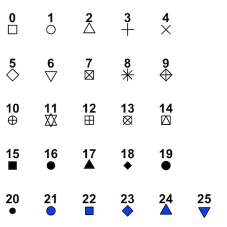

```{r setup, include=FALSE}
knitr::opts_chunk$set(echo = TRUE, comment = NA)
```


## Gráfico básico de puntos
- `plot(x,y)`: para dibujar un gráfico básico de puntos siendo $x,y$ vectores numéricos
    - `plot(x)` = `plot(1:length(x),x)`
    
- `plot(x,función)`: para dibujar el gráfico de una función 


## Gráfico básico de puntos

```{r, fig.height = 4, fig.width = 7, fig.align = "center"}
alumnos = c(1:10)
notas = c(2,5,7,9,8,3,5,6,10,7)
plot(alumnos,notas)
```


## Parámetros de la función plot()

- `log`: para indicar que queremos el gráfico en escala logarítmica
- `main("título")`: para poner título al gráfico. Si en vez de un texto queráis poner una expresión matemática, tenéis que utilizar la función `expression()` 
- `xlab("etiqueta")`: para poner etiqueta al eje $X$
- `ylab("etiqueta")`: para poner etiqueta al eje $Y$
- `pch=n`: para elegir el símbolo de los puntos. $n=0,1,...,25$. El valor por defecto es `pch = 1`
- `cex`: para elegir el tamaño de los símbolos
- `col="color en inglés"`: para elegir el color de los símbolos. [Gama de colores](http://www.stat.columbia.edu/~tzheng/files/Rcolor.pdf).


## Parámetro pch - Tipos de símbolos

<div class="aligncenter">

</div>


## Escala logarítmica

```{r, fig.height = 3.75, fig.width = 9, fig.align = "center"}
par(mfrow = c(1,2))
plot = plot(exp(1:20), xlab = "Indice", ylab = expression(e^{1:20}), 
            main = "Escala lineal")
plotLog = plot(exp(1:20), log = "y", xlab = "Indice", ylab = expression(e^{1:20}), 
               main = "Escala logaritmica en el eje y")
par(mfrow = c(1,1))
```


## Parámetros de la función plot()

- `type`: para elegir el tipo de gráfico que queremos:
    - `p`: puntos (valor por defecto)
    - `l`: líneas rectas que unen los puntos (dichos puntos no tienen símbolo)
    - `b`: líneas rectas que unen los puntos (dichos puntos tienen símbolo). Las líneas no traspasan los puntos
    - `o`: como el anterior pero en este caso las líneas sí que traspasan los puntos
    - `h`: histograma de líneas
    - `s`: histograma de escalones
    - `n`: para no dibujar los puntos


## Tipos de gráfico

```{r, eval=FALSE}
par(mfrow = c(3,2))
x = c(50:59)
y = c(2,9,25,3,100,77,62,54,19,40)
plot(x,y, pch = 23, cex = 2, col = "blue", type = "p")
plot(x,y, pch = 23, cex = 2, col = "blueviolet", type = "l")
plot(x,y, pch = 23, cex = 2, col = "gold", type = "b")
plot(x,y, pch = 23, cex = 2, col = "deeppink", type = "o")
plot(x,y, pch = 23, cex = 2, col = "springgreen", type = "h")
plot(x,y, pch = 23, cex = 2, col = "firebrick1", type = "s")
par(mfrow = c(1,1))
```

## Tipos de gráfico

```{r, echo=FALSE, fig.width = 7, fig.align = "center", fig.height=5.5}
par(mfrow = c(3,2))
x = c(50:59)
y = c(2,9,25,3,100,77,62,54,19,40)
plot(x,y, pch = 23, cex = 2, col = "blue", type = "p")
plot(x,y, pch = 23, cex = 2, col = "blueviolet", type = "l")
plot(x,y, pch = 23, cex = 2, col = "gold", type = "b")
plot(x,y, pch = 23, cex = 2, col = "deeppink", type = "o")
plot(x,y, pch = 23, cex = 2, col = "springgreen", type = "h")
plot(x,y, pch = 23, cex = 2, col = "firebrick1", type = "s")
par(mfrow = c(1,1))
```

## Parámetros de la función plot()

- `lty`: para especificar el tipo de línea
    - "solid" : $1$: línea continua (valor por defecto)
    - "dashed" : $2$: línea discontinua
    - "dotted" : $3$: línea de puntos
    - "dotdashed" : $4$: línea que alterna puntos y rayas
    
- `lwd`: para especificar el grosor de las líneas
- `xlim`: para modificar el rango del eje $X$
- `ylim`: para modificar el rango del eje $Y$
- `xaxp`: para modificar posiciones de las marcas en el eje $X$
- `yaxp`: para modificar posiciones de las marcas en el eje $Y$


## Parámetros de la función plot()

```{r, fig.height = 4, fig.width = 9, fig.align = "center"}
x = (2*(1:20))
y = (-1)^(1:20)*5*(1:20)
plot(x,y, main = "Ejemplo de grafico", pch = 8, cex = 1, type = "b", lty = 4, lwd = 4, 
     xaxp = c(0,40,2), yaxp = c(-100,100,8))
```


## Añadir elementos al gráfico

- `points(x,y)`: añade un punto de coordenadas $(x, y)$ a un gráfico ya existente
- `abline`: para añadir una recta a un gráfico ya existente
    - `abline(a,b)`: añade la recta $y=bx+a$
    - `abline(v = x0)`: añade la recta vertical $x=x_0$. $v$ puede estar asignado a un vector
    - `abline(h = y0)`:  añade la recta horizontal $y=y_0$. $h$ puede estar asignado a un vector
    

## Añadiendo punto y recta

```{r, eval=FALSE}
x = (2*(1:20))
y = (-1)^(1:20)*5*(1:20)
plot(x,y, main = "Poniendo un punto y una recta", pch = 8, cex = 1, type = "b", lty = 4, 
     lwd = 4, xaxp = c(0,40,2), yaxp = c(-100,100,8))
points(20,0, col = "red", cex = 4, pch = 16)
abline (h = 0, lty = 2, col = "dodgerblue")
```

## Añadiendo punto y recta

```{r, echo = FALSE, fig.width = 9, fig.align = "center"}
x = (2*(1:20))
y = (-1)^(1:20)*5*(1:20)
plot(x,y, main = "Poniendo un punto y una recta", pch = 8, 
     cex = 1, type = "b", lty = 4, lwd = 4, 
     xaxp = c(0,40,2), yaxp = c(-100,100,8))
points(20,0, col = "red", cex = 4, pch = 16)
abline (h = 0, lty = 2, col = "dodgerblue")
```

## Añadir elementos al gráfico

- `text(x,y,labels = "....")`: añade en el punto de coordenadas $(x,y)$ el texto especificado como argumento de labels
    - `pos`: permite indicar la posición del texto alrededor de las coordenadas $(x,y)$. Admite los siguientes valores:
        - 1: abajo
        - 2: izquierda
        - 3: arriba
        - 4: derecha
        - 5: sin especificar: el texto se sitúa centrado en el punto $(x,y)$
    
    
## Añadiendo etiquetas

```{r, fig.width = 9, fig.height = 3.75,fig.align = "center"}
alumnos = c(1:10)
notas = c(2,5,7,9,8,3,5,6,10,7)
plot(alumnos,notas, main = "Grafico con texto")
text(alumnos,notas, labels = c("S","A","N","E","N","S","A","A","E","N"), 
     pos = c(rep(3,times = 8),1,3))
```


## Añadir elementos al gráfico

- `lines(x, y)`:añade a un gráfico existente una línea poligonal que une los puntos $(x_i, y_i)$ sucesivos. $x,y$ son vectores numéricos
- `curve(curva)`: permite añadir la gráfica de una curva a un gráfico existente
    - `add=TRUE`: si no, la curva no se añade
    - La curva se puede especificar mediante una expresión algebraica con variable $x$, o mediante su nombre si la hemos definido antes
    
    

## Añadiendo líneas y curvas

```{r, results='hide', fig.align="center", fig.height=4}
x = c(5*(1:20))
plot(x,c(exp(-x)+(-1)^x*x/2*sin(x)^2))
lines(c(20,10,40,80,60,60,20),c(20,0,-20,-20,40,0,20), lwd = 2, col = "darkslategray1")
curve(20*sin(x), add = TRUE, col = "green")
```

## Añadir elementos al gráfico

- `legend(posición, legend = ...)`: para añadir una leyenda
    - La posición indica donde queremos situar la leyenda. Puede ser o bien las coordenadas de la esquina superior izquierda de nuestra leyenda, o bien una de las palabras siguientes:
        - "bottom" / "bottomright" / "bottomleft"
        - "top" / "topright" / "topleft"
        - "center" / "right" / "left"
        
    - `legend`: contiene el vector de nombres entre comillas con los que queremos identificar a las curvas en la leyenda
    
    
## Añadiendo leyenda

```{r, eval = FALSE}
x = seq(0,2*pi,0.1)
plot(x,sin(x),type="l",col="blue",lwd=3, xlab="", ylab="")
lines(x,cos(x),col="green",lwd=3)
lines(x, tan(x), col="purple",lwd=3)
legend("bottomleft",col=c("blue","green","purple"), legend=c("Seno","Coseno", "Tangente"), 
       lwd=3, bty="l")
```


## Añadiendo leyenda

```{r, echo = FALSE, fig.align="center"}
x = seq(0,2*pi,0.1)
plot(x,sin(x),type="l",col="blue",lwd=3,
     xlab="", ylab="")
lines(x,cos(x),col="green",lwd=3)
lines(x, tan(x), col="purple",lwd=3)
legend("bottomleft",col=c("blue","green","purple"),
     legend=c("Seno","Coseno", "Tangente"), lwd=3, bty="l")
```

## Añadir elementos al gráfico

- `segments`: para añadir segmentos a un gráfico existente
- `arrows`: para añadir flechas a un gráfico existente
- `symbols`: para añadir símbolos a un gráfico existente
- `polygon`: para añadir polígonos cerrados especificando sus vértices a un gráfico existente


## Añadiendo elementos

```{r, eval = FALSE}
x = c(5*(1:10))
plot(x,c(exp(-x)+(-1)^x*x/2*sin(x)^2), xlab = "", ylab = "", 
     main = "Grafico con varios elementos")
segments(10,0,40,0, col = "red", lwd = 4)
arrows(10,0,40,-10, col = " blue", length = 0.5, angle = 5, code = 3)
symbols(40,0,stars = cbind(1,.5,1,.5,1,.5,1,.5,1,.5), add = TRUE, lwd = 3, inches = 0.5)
symbols(40,0,stars = cbind(1,.5,1,.5,1,.5,1,.5,1,.5), add = TRUE, lwd = 3)
polygon(c(20,30,40),c(10,-10,10), col = "gold", density = 3, angle = 90, lty = 4, 
        lwd = 5)
```

## Añadiendo elementos

```{r, echo = FALSE, fig.align="center"}
x = c(5*(1:10))
plot(x,c(exp(-x)+(-1)^x*x/2*sin(x)^2), xlab = "", ylab = "", 
     main = "Grafico con varios elementos")
segments(10,0,40,0, col = "red", lwd = 4)
arrows(10,0,40,-10, col = " blue", length = 0.5, angle = 5, code = 3)
symbols(40,0,stars = cbind(1,.5,1,.5,1,.5,1,.5,1,.5),
        add = TRUE, lwd = 3, inches = 0.5)
symbols(40,0,stars = cbind(1,.5,1,.5,1,.5,1,.5,1,.5),
        add = TRUE, lwd = 3)
polygon(c(20,30,40),c(10,-10,10), col = "gold", density = 3, 
        angle = 90, lty = 4, lwd = 5)
```


