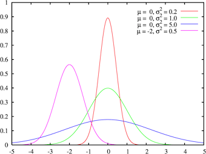

```{r setup, include=FALSE}
knitr::opts_chunk$set(echo = TRUE, comment = NA)
```


## Introducción

Aunque no seamos completamente conscientes de ello, tendemos a agrupar datos cuantitativos constantemente. 

Sin ir más lejos, calificamos de excelente a todas las notas que están sobre el 9. También decimos que una persona tiene 20 años cuando se encuentra en el intervalo [20,21). Es decir, cuando ha cumplido los 20 pero aún no tiene los 21.

En estadística, existen innumerables motivos por los cuales nos interesa agrupar los datos cuando estos son cuantitativos. Uno de estos motivos puede ser perfectamente que los datos sean muy heterogéneos. En este caso, nos encontraríamos con que las frecuencias de los valores individuales serían todas muy similares, lo que daría lugar a un diagrama de barras muy difícil de interpretar, tal y como mostramos en el siguiente ejemplo.

## Ejemplo 1

<div class = "example">
**Ejemplo 1**

Consideremos la siguiente muestra de 24 pesos de estudiantes:
</div>

```{r}
pesos = c(55.2,54.0,55.2,53.7,60.2,53.2,54.6,55.1,51.2,53.2,54.8,52.3,56.9,57.0,55.0,
          53.5,50.9,55.1,53.6,61.2,59.5,50.3,52.7,60.0)
```

<div class = "example">
El diagrama de barras de sus frecuencias absolutas, tomando como posibles niveles todos los pesos  entre su mínimo y máximo se muestra en la siguiente diapositiva.

Como vemos, todas estas frecuencias se encuentran entre 0 y 2, cosa que no nos da mucha información.
</div>

## Ejemplo 1

```{r}
barplot(table(pesos))
```

## Ejemplo 1

<div class = "example">
En cambio, si dividiésemos todos estos posibles valores que puede tomar la variable cuantitativa en intervalos y tomásemos como sus frecuencias las de todos los valores que caen en dicho intervalo, la cosa cambia. 

En este caso, sería mucho más fácil interpretar los resultados, ya que estos darán mucha más información. Más adelante veremos como crear estos intervalos.
</div>

```{r, echo=FALSE}
hist(pesos, breaks = 6, right = FALSE, main = "", ylab = "Frecuencia", xlab = "pesos")
```

## Introducción

Otro de los motivos por el que necesitamos muchas veces agrupar los datos cuantitativos es porque, como ya dijimos en temas anteriores, la precisión infinita no existe. 
Por tanto, esta imposibilidad de medir de manera exacta muchas de las magnitudes continuas (tiempo, peso, altura...) nos obliga a trabajar con aproximaciones o redondeos de valores reales y que cada uno de estos represente todo un intervalo de posibles valores.

## Introducción

Por lo general, existen 3 situaciones en las cuales conviene sin lugar a dudas agrupar datos cuantitativos en intervalos, también llamados <l class = "definition">clases</l>

- Cuando los datos son continuos, su redondeo ya define un agrupamiento debido a la inexistencia de precisión infinita
- Cuando los datos son discretos, pero con un número considerablemente grande de posibles valores
- Cuando tenemos muchísimos datos y estamos interesados en estudiar las frecuencias de sus valores

# Cómo agrupar datos

## Los 4 pasos

Antes de estudiar unos datos agrupados, hay que, obviamente, agruparlos. Este proceso consta de 4 pasos:

1. Decidir el número de intervalos que vamos a utilizar
2. Decidir la amplitud de estos intervalos
3. Acumular los extremos de los intervalos
4. Calcular el valor representativo de cada intervalo, su <l class = "definition">marca de clase</l>

No hay una forma de agrupar datos mejor que otra. Eso sí, cada uno de los diferentes agrupamientos para un conjunto de datos podría sacar a la luz características diferentes del conjunto.

## La función hist()

La función de R por excelencia para estudiar datos agrupados es `hist`. Dicha función implementa los 4 pasos del proceso.

Si le indicamos como argumentos el vector de datos y el número de intervalos que deseamos, o bien el método para determinarlo (cosa que veremos a continuación), la función agrupará los datos en el número de clases que le hemos introducido, más o menos. Eso sí, sin control de ningún tipo por nuestra parte sobre los intervalos que produce.

Esto puede venirnos bien en algunos casos, pero no en otros.

## Estableciendo el número de clases

En este tema explicaremos una receta para agrupar datos. Lo dicho, ni mejor ni peor que el resto.

Lo primero es establecer el número $k$ de clases en las que vamos a dividir nuestros datos. Podemos decidir en función de nuestros intereses o podemos hacer uso de alguna de las reglas existentes. Destacaremos las más populares. Sea $n$ el número total de datos de la muestra

- <l class = "definition">Regla de la raíz cuadrada</l>: $k = \lceil\sqrt{n}\ \rceil$
- <l class = "definition">Regla de Sturges</l>: $k = \lceil 1+\log_{2}(n)\rceil$

## Estableciendo el número de clases

- <l class = "definition">Regla de Scott</l>: Se determina primero la <l class = "definition">amplitud teórica</l>, $A_S$ de las clases $$A_S = 3.5\cdot\tilde{s}\cdot n^{-\frac{1}{3}}$$
donde $\tilde{s}$ es la desviación típica muestral. Luego se toma $$k = \left\lceil \frac{\max(x)-\min(x)}{A_S}\right\rceil$$

## Estableciendo el número de clases

- <l class = "definition">Regla de Freedman-Diaconis</l>: Se determina primero la <l class = "definition">amplitud teórica</l>, $A_{FD}$ de las clases $$A_{FD} = 2\cdot(Q_{0.75}-Q_{0.25})\cdot n^{-\frac{1}{3}}$$ (donde, recordemos, $Q_{0.75}-Q_{0.25}$, es el rango intercuantílico) y entonces 
$$k = \left\lceil \frac{\max(x)-\min(x)}{A_{FD}}\right\rceil$$

Si os fijáis, las dos primeras solo dependen de $n$, mientras que las dos últimas también tienen en cuenta, de formas diferentes, la dispersión de los datos. De nuevo, no hay ninguna mejor que las demás. Pero sí puede ocurrir que métodos diferentes den lugar a la observación de características diferentes en los datos.

## Estableciendo el número de clases con R

Las instrucciones para llevar a cabo las 3 últimas reglas con R son, respectivamente,

- `nclass.Sturges`
- `nclass.scott`
- `nclass.FD`

Puede ocurrir que las difrentes reglas den valores diferentes, o no.

## Decidiendo la amplitud

Una vez determinado $k$, hay que decidir su amplitud. 

La forma más fácil y la que nosotros utilizaremos por defecto es que la amplitud de todos los intervalos sea la misma, $A$. Esta forma no es la única.

Para calcular $A$, lo que haremos será dividir el rango de los datos entre $k$, el número de clases, y redondearemos por exceso a un valor de la precisión de la medida.

Si se da el improbable caso en que el cociente de exacto, tomaremos como $A$ ese cociente más una unidad de precisión.

## Extremos de los intervalos

Es la hora de calcular los extremos de los intervalos. Nosotros tomaremos estos intervalos siempre cerrados por su izquierda y abiertos por la derecha, debido a que esta es la forma en que R los construye y porque es así como se utilizan en Teoría de Probabilidades al definir la distribución de una variable aleatoria discreta y también en otras muchas situaciones cotidianas.

Utilizaremos la siguiente notación
$$[L_1,L_2),[L_2,L_3),\dots,[L_k,L_{k+1})$$

donde los $L_i$ denotan los extremos de los intervalos. Estos se calculan de la siguiente forma:

$$L_1 = \min(x)-\frac{1}{2}\cdot \text{precisión}$$

## Extremos de los intervalos

A partir de $L_1$, el resto de intervalos se obtiene de forma recursiva:
$$L_2 = L_1 + A$$
$$L_3 = L_2 + A$$
$$\vdots$$
$$L_{k+1} = L_k+A$$

Si nos fijamos bien, los extremos forman una progresión aritmética de salto $A$: $$L_{i} = L_{1}+(i-1)A,\qquad i=2,\dots,k+1$$

De esta forma garantizamos que los extremos de los intervalos nunca coincidan con valores del conjunto de datos, puesto que tinen una precisión mayor.

## Marca de clase

Solo nos queda determinar la <l class = "definition">marca de clase</l>, $X_i$, de cada intervalo $[L_i,L_{i+1})$.

Este no es más que un valor del intervalo que utilizaremos para identificar la clase y para calcular algunos estadísticos.

Genralmente, $$X_i = \frac{L_i+L_{i+1}}{2}$$ es decir, $X_i$ será el punto medio del intervalo, para así garantizar que el error máximo cometido al describir cualquier elemento del intervalo por medio de su marca de clase sea mínimo o igual a la mitad de la amplitud del respectivo intervalo.

## Marca de clase

Es sencillo concluir que, al tener todos los intervalos amplitud $A$, la distancia entre $X_i$ y $X_{i+1}$ tambien será $A$. Por consiguiente,

 $$X_{i} = X_1+ (i-1)A,\qquad i=2,\dots,k$$
 
 donde $$X_1 = \frac{L_1+L_2}{2}$$

# Ejemplo 2

## Enunciado {.example}

**Ejemplo 2**

Vamos a considerar el conjunto de datos de `datacrab`. Para nuestro estudio, trabajaremos únicamente con la variable `width`.

Llevaremos a cabo los 4 pasos explicados con anterioridad: cálculo del número de intervalos, determinación de la amplitud, cálculo de los extremos y las marcas de clase.

## Solución

En primer lugar, cargamos los datos en un data frame:

```{r}
crabs = read.table("../data/datacrab.txt", header = TRUE)
str(crabs)
cw = crabs$width
```

A continuación, definimos la variable `cw` que contiene los datos de la variable `width`.

## Solución

Calculemos el número de clases según las diferentes reglas que hemos visto:

- Regla de la raíz cuadrada:

```{r}
n = length(cw)
k1 = ceiling(sqrt(n))
k1
```

- Regla de Sturges:

```{r}
k2 = ceiling(1+log(n,2))
k2
```

## Solución

- Regla de Scott:

```{r}
As = 3.5*sd(cw)*n^(-1/3) #Amplitud teórica
k3 = ceiling(diff(range(cw))/As)
k3
```

- Regla de Freedman-Diaconis:

```{r}
#Amplitud teórica
Afd = 2*(quantile(cw,0.75, names = FALSE)-quantile(cw,0.25,names = FALSE))*n^(-1/3) 
k4 = ceiling(diff(range(cw))/Afd)
k4
```

## Solución

Podemos comprobar nuestros 3 últimos resultados con R:

```{r}
nclass.Sturges(cw)
nclass.scott(cw)
nclass.FD(cw)
```

De momento, vamos a seguir la Regla de Scott. Es decir, vamos a considerar `r nclass.scott(cw)` intervalos.

## Solución

A continuación, debemos elegir la amplitud de los intervalos.

```{r}
A = diff(range(cw)) / 10
A
```

Como nuestros datos están expresados en mm con una precisión de una cifra decimal, debemos redondear por exceso a un cifra decimal el resultado obtenido. Por lo tanto, nuestra amplitud será de 

```{r}
A = 1.3
```

Recordad que si el cociente nos hubiera dado un valor exacto con respecto a la precisión, tendríamos que haberle sumado una unidad de precisión.

## Solución

Ahora nos toca calcular los extremos $L_1,\dots,L_{11}$ de los intervalos.

Recordad que nuestros intervalos tendrán la siguiente forma:

$$[L_1,L_2),\ \dots,\ [L_{10},L_{11})$$
Calculamos el primer extremo:

```{r}
L1 = min(cw)-1/2*0.1
L1
```

donde 0.1 es nuestra precisión (décimas de unidad, en este caso).

## Solución

Y, el resto de extremos se calculan del siguiente modo:

```{r}
L2 = L1 + A
L3 = L2 + A
L4 = L3 + A
L5 = L4 + A
L6 = L5 + A
L7 = L6 + A
L8 = L7 + A
L9 = L8 + A
L10 = L9 + A
L11 = L10 + A
L = c(L1,L2,L3,L4,L5,L6,L7,L8,L9,L10,L11)
L
```

## Solución

O bien, si queremos facilitarnos el trabajo, también los podemos calcular mucho más rápido del siguiente modo:

```{r}
L = L1 + A*(0:10)
L
```

Así, nuestros intervalos serán los siguientes:

$$[20.95,22.25),\ [22.25,23.55),\ [23.55,24.85),\ [24.85,26.15),\ [26.15,27.45),$$ $$[27.45,28.75),\ [28.75,30.05),\ [30.05,31.35),\ [31.35,32.65),\ [32.65,33.95)$$

## Solución

Y hemos llegado al úlitmo paso: calcular las marcas de clase.

Recordemos que $X_i = \frac{L_{i}+L_{i+1}}{2} \quad\forall i=1,\dots,10$

Empecemos calculando $X_1$

```{r}
X1 = (L[1]+L[2])/2
X1
```


## Solución

Y, el resto de marcas de clase se calculan del siguiente modo:

```{r}
X2 = X1 + A
X3 = X2 + A
X4 = X3 + A
X5 = X4 + A
X6 = X5 + A
X7 = X6 + A
X8 = X7 + A
X9 = X8 + A
X10 = X9 + A
X = c(X1,X2,X3,X4,X5,X6,X7,X8,X9,X10)
X
```

## Solución

O bien, si queremos facilitarnos el trabajo, también los podemos calcular mucho más rápido como sucesión:

```{r}
X = X1 + A*(0:9)
X
```

o también, como punto medio del intervalo

```{r}
X = (L[1:length(L)-1]+L[2:length(L)])/2
X
```

## Ejercicio{.exercise}

Repetir este proceso para el número de clases obtenido con 

- la regla de la raíz 
- la regla de Sturges 
- la regla de Freedman-Diaconis


# Agrupando datos con R


## Agrupando los datos con R

Al agrupar los datos, lo que hacemos es convertir nuestra variable cuantitativa en un factor cuyos niveles son las clases en que ha sido dividida e identificamos cada dato con su clase.

A la hora de etiquetar los niveles, podemos elegir 3 codificaciones:

- Los intervalos
- Las marcas de clase (el punto medio de cada intervalo)
- El número de orden de cada intervalo

## La función cut

Esta función es la básica en R para agrupar un vector de datos numéricos y codificar sus valores con clases a las que pertenecen.

Su sintaxis básica es

<div class = "aligncenter">`cut(x, breaks=..., labels=..., right=...)`
</div>

- `x` es el vector numérico, nuestra variable cuantitativa
- `breaks` puede ser un vector numérico formado por los extremos de los intervalos en los que queremos agrupar nuestros datos y que habremos calculado previamente. También puede ser un número $k$, en cuyo caso R agrupa los datos en $k$ clases. Para este caso, R divide el intervalo comprendido entre los valores mínimo y máximo de $x$ en $k$ intervalos y, a continuación, desplaza ligeramente el extremo inferior del primer intervalo a la izquierda y el extremo del último, a la derecha.

## La función cut

- `labels` es un vector con las etiquetas de los intervalos. Su valor por defecto es utilizar la etiqueta de los mismos intervalos. Si especificamos `labels = FALSE`, obtendremos los intervalos etiquetados por medio de los números naturales correlativos, empezando por 1. Para utilizar como etiqueta las marcas de clase o cualquier otra codificación, hay que entrarlo como valor de este parámetro.
- `right` es un parámetro que igualadao a `FALSE` hace que los intervalos que consideremos sean cerrados por la izquierda y abiertos por la derecha. Este no es su valor por defecto.
- `include.lowest` igualdo a `TRUE` combinado con `right = FALSE` hace que el último intervalo sea cerrado. Puede sernos útil en algunos casos.

## La función cut

En cualquier caso, el resultado de la función `cut` es una lista con los elementos del vector original codificados con las etiquetas de las clases a las que pertenecen. Bien puede ser un factor o un vector.

# Estudiando datos agrupados

## Frecuencias

Una primera consideración es tratar las clases obtenidas en el paso anterior como los niveles de una variable ordinal y calcular sus frecuencias.

- La frecuencia absoluta de una clase será el número de datos originales que pertenecen a la clase
- La frecuencia absoluta acumulada de una clase será el número de datos que pertenecen a dicha clase o alguna de las anteriores

## Tabla de frecuencias

Normalmente, las frecuencias de un conjunto de datos agrupados se suele representar de la siguiente forma

| Intervalos | $X_j$ | $n_j$ | $N_j$ | $f_j$ | $F_j$ |  
|-------------------|--------------------|--------------------|--------------------|--------------------|--------------------|
|$[L_1,L_2)$|$X_1$|$n_1$|$N_1$|$f_1$|$F_1$|
|$[L_2,L_3)$|$X_2$|$n_2$|$N_2$|$f_2$|$F_2$|
|$\vdots$|$\vdots$|$\vdots$|$\vdots$|$\vdots$|$\vdots$|
|$[L_k,L_{k+1})$|$X_k$|$n_k$|$N_k$|$f_k$|$F_k$|


## La función hist

El cálculo de las frecuencias con R podemos hacerlo mediante las funciones `table`, `prop.table` y `cumsum`.

También podemos utilizar la función `hist`, que internamente genera una list cuya componente `count` es el vector de frecuencias absolutas de las clases. Por consiguiente, para calcular estas frecuencias, podemos utilizar la sintaxis

<div class = "aligncenter">`hist(x, breaks=..., right=FALSE, plot=FALSE)$count`
</div>


Conviene igualar el parámetro `breaks` al vector de los extremos del intervalo debido a que `cut` y `hist` hacen uso de diferentes métodos para agrupar los datos cuando se especifica solamente el número $k$ de clases.

El resultado de `hist` incluye la componente `mids` que contiene el vector de puntos medios de los intervalos, es decir, nuestras marcas de clase.

## Tabla de frecuencias con R

Podemos automatizar el cálculo de la ya tan mencionada tabla de frecuencias, utilizando las dos funciones que mostramos a continuación. 

La primera sirve en el caso en que vayamos a tomar todas las clases de la misma amplitud. Sus parámetros son: $x$, el vector con los datos cuantitativos; $k$, el número de clases; $A$, su amplitud; y $p$, la precisión de los datos (p = 1 si la precisión son unidades, p = 0.1 si la precisión son décimas de unidad...).

Por su parte, la segunda es para cuando conocemos los extremos de las clases. Sus parámetros son: $x$, el vector con los datos cuantitativos; $L$, el vector de extremos de clases; y $V$ , un valor lógico, que ha de ser `TRUE` si queremos que el último intervalo sea cerrado, y `FALSE` en caso contrario.

## Tablas de frecuencias con R

```{r}
#Primera función
TablaFrecs = function(x,k,A,p){ 
  L = min(x)-p/2+A*(0:k)
  x_cut = cut(x, breaks = L, right=FALSE)
  intervals = levels(x_cut)
  mc = (L[1]+L[2])/2+A*(0:(k-1))
  Fr.abs = as.vector(table(x_cut)) 
  Fr.rel = round(Fr.abs/length(x),4) 
  Fr.cum.abs = cumsum(Fr.abs) 
  Fr.cum.rel = cumsum(Fr.rel)
  tabla = data.frame(intervals, mc, Fr.abs, Fr.cum.abs, Fr.rel, Fr.cum.rel)
  tabla
  }
```

## Tablas de frecuencias

```{r}
TablaFrecs.L = function(x,L,V){
  x_cut = cut(x, breaks=L, right=FALSE, include.lowest=V)
  intervals = levels(x_cut)
  mc = (L[1:(length(L)-1)]+L[2:length(L)])/2
  Fr.abs = as.vector(table(x_cut)) 
  Fr.rel = round(Fr.abs/length(x),4)
  Fr.cum.abs = cumsum(Fr.abs)
  Fr.cum.rel = cumsum(Fr.rel)
  tabla = data.frame(intervals, mc, Fr.abs, Fr.cum.abs, Fr.rel, Fr.cum.rel)
  tabla
  }
```


# Ejemplo 2 - Continuación

## Enunciado{.example}

**Ejemplo 2**

Siguiendo con el ejemplo de las anchuras de los cangrejos, vamos a calcular sus tablas de frecuencias haciendo uso de todo lo aprendido anteriormente.

## Solución

La tabla queda del siguiente modo:

```{r, echo = FALSE}
n = c(length(which(cw>=L[1] & cw<L[2])),length(which(cw>=L[2] & cw<L[3])),length(which(cw>=L[3] & cw<L[4])),length(which(cw>=L[4] & cw<L[5])),length(which(cw>=L[5] & cw<L[6])),length(which(cw>=L[6] & cw<L[7])),length(which(cw>=L[7] & cw<L[8])),length(which(cw>=L[8] & cw<L[9])),length(which(cw>=L[9] & cw<L[10])),length(which(cw>=L[10] & cw<L[11])))
N = cumsum(n)
f = round(n/N[10],4)
FF = cumsum(f)
```

| Intervalos | $X_j$ | $n_j$ | $N_j$ | $f_j$ | $F_j$ |  
|-------------------|--------------------|--------------------|--------------------|--------------------|--------------------|
|[`r L[1]`, `r L[2]`)|`r X[1]`|`r n[1]`|`r N[1]`|`r f[1]`|`r FF[1]`|
|[`r L[2]`, `r L[3]`)|`r X[2]`|`r n[2]`|`r N[2]`|`r f[2]`|`r FF[2]`|
|[`r L[3]`, `r L[4]`)|`r X[3]`|`r n[3]`|`r N[3]`|`r f[3]`|`r FF[3]`|
|[`r L[4]`, `r L[5]`)|`r X[4]`|`r n[4]`|`r N[4]`|`r f[4]`|`r FF[4]`|
[`r L[5]`, `r L[6]`)|`r X[5]`|`r n[5]`|`r N[5]`|`r f[5]`|`r FF[5]`|
|[`r L[6]`, `r L[7]`)|`r X[6]`|`r n[6]`|`r N[6]`|`r f[6]`|`r FF[6]`|

## Solución

| Intervalos | $X_j$ | $n_j$ | $N_j$ | $f_j$ | $F_j$ |  
|-------------------|--------------------|--------------------|--------------------|--------------------|--------------------|
|[`r L[7]`, `r L[8]`)|`r X[7]`|`r n[7]`|`r N[7]`|`r f[7]`|`r FF[7]`|
|[`r L[8]`, `r L[9]`)|`r X[8]`|`r n[8]`|`r N[8]`|`r f[8]`|`r FF[8]`|
|[`r L[9]`, `r L[10]`)|`r X[9]`|`r n[9]`|`r N[9]`|`r f[9]`|`r FF[9]`|
|[`r L[10]`, `r L[11]`)|`r X[10]`|`r n[10]`|`r N[10]`|`r f[10]`|`r FF[10]`|

## Solución

Y, ahora, lo haremos con las funciones que os hemos proporcionado:

```{r}
TablaFrecs(cw,10,1.3,0.1)
```

## Solución

```{r}
TablaFrecs.L(cw,L,FALSE)
```

Fijaos que los intervalos no terminan de ser los que hemos calculado nosotros, pero eso se debe a como funciona la función `cut`.

# Ejemplo 3

## Enunciado{.example}

**Ejemplo 3**

Se han recogido las notas de un examen de historia a los 100 alumnos de primero de bachillerato de un instituto.

Vamos a hacer uso de todo lo aprendido para obtener la mayor información posible utilizando las funciones `cut` e `hist` y también, las proporcionadas por nosotros.

## Solución

Los resultados obtenidos en la encuesta han sido:

```{r, echo = FALSE}
set.seed(4)
notas = sample(0:10,100, replace = TRUE)
set.seed(NULL)
```

```{r}
notas
```

## Solución

Vamos a agrupar las notas en los siguientes intervalos:

$$[0,5),\ [5,7),\ [7,9),\ [9,10]$$

Claramente, estos 4 intervalos no tienen la misma amplitud.

Fijémonos también en que el último intervalo está cerrado por la derecha.

## Solución

```{r}
#Definimos vector de extremos
L = c(0,5,7,9,10)
#Definimos notas1 como el resultado de la codificación en intervalos utilizando como 
#etiquetas los propios intervalos
notas1 = cut(notas, breaks = L, right = FALSE, include.lowest = TRUE)
notas1
```

## Solución

```{r}
#Definimos las marcas de clase
MC = (L[1:length(L)-1]+L[2:length(L)])/2
#Definimos notas2 como el resultado de la codificación en intervalos utilizando como 
#etiquetas las marcas de clase
notas2 = cut(notas, breaks = L, labels = MC, right = FALSE, include.lowest = TRUE)
notas2
```

## Solución

```{r}
#Definimos notas3 como el resultado de la codificación en intervalos utilizando como 
#etiquetas la posición ordenada del intervalo (1, 2, 3 o 4)
notas3 = cut(notas, breaks = L, labels = FALSE, right = FALSE, include.lowest = TRUE)
notas3
```

## Solución

```{r}
#Definimos notas4 como el resultado de la codificación en intervalos utilizando como 
#etiquetas Susp, Aprob, Not y Exc
notas4 = cut(notas, breaks = L, labels = c("Susp", "Aprob", "Not", "Exc"), right = FALSE, include.lowest = TRUE)
notas4
```

## Solución

El resultado de `cut` ha sido, en cada caso, una lista con los elementos del vector original codificados con las etiquetas de las clases a las que pertenecen. 

Las dos primeras aplicaciones de la función `cut` han producido factores (cuyos niveles son los intervalos y las marcas de clase, respectivamente, en ambos casos ordenados de manera natural), mientras que aplicándole `labels = FALSE` hemos obtenido un vector.

## Solución

¿Qué habría ocurrido si le hubiéramos pedido a R que cortase los datos en 4 intervalos?

Pues en este caso no nos hubiera servido de mucho, sobre todo porque la amplitud de nuestros intervalos era, desde buen inicio, diferente.

## Solución

```{r}
cut(notas, breaks = 4, right = FALSE, include.lowest = TRUE)
```

## Solución

R ha repartido los datos en 4 intervalos de longitud 2.5, y ha desplazado ligeramente a la izquierda el extremo izquierdo del primer intervalo. 

## Solución

Trabajaremos ahora con `notas4` y calcularemos sus frecuencias:

```{r}
table(notas4) #Fr. Abs
prop.table(table(notas4)) #Fr. Rel
```

## Solución

```{r}
cumsum(table(notas4)) #Fr. Abs. Cum
cumsum(prop.table(table(notas4))) #Fr. Rel. Cum
```

## Solución

Podríamos haber obtenido todo lo anterior haciendo uso de la función `hist`.

```{r}
notasHist = hist(notas, breaks = L, right = FALSE, include.lowest = TRUE, plot = FALSE)
FAbs = notasHist$count
FRel = prop.table(FAbs)
FAbsCum = cumsum(FAbs)
FRelCum = cumsum(FRel)
```

## Solución

Ahora ya podemos crear un data frame con todas estas frecuencias:

```{r}
intervalos = c("[0,5)","[5,7)","[7,9)","[9,10]")
calificacion = c("Suspenso", "Aprobado", "Notable", "Excelente")
marcas = notasHist$mids
tabla.Fr = data.frame(intervalos,calificacion,marcas,FAbs,FAbsCum,FRel,FRelCum)
tabla.Fr
```

## Solución

O bien, podríamos haber utilizado las funciones que os hemos proporcionado:

```{r}
TablaFrecs.L(notas, L, TRUE)
```


# Estadísticos para datos agrupados

## Estadísticos para datos agrupados

Al tener una muestra de datos numéricos, conviene calcular los <l class = "definition"> estadísticos </l> antes de realizar los agrupamientos, puesto que de lo contrario podemos perder información.

No obstante, hay situaciones en que los datos los obtenemos ya agrupados. En estos casos, aún sigue siendo posible calcular los estadísticos y utilizarlos como aproximaciones de los estadísticos de los datos "reales", los cuales no conocemos.

## Estadísticos para datos agrupados

La media $\bar{x}$, la varianza, $s^2$, la varianza muestral, $\tilde{s}^2$, la desviación típica, $s$, y la desviación típica muestral, $\tilde{s}$ de un conjunto de datos agrupados se calculan mediante las mismas fórmulas que para los datos no agrupados con la única diferencia de que sustituimos cada clase por su marca de clase y la contamos con su frecuencia.

Es decir, si tenemos $k$ clases, con sus respectivas marcas $X_1,\dots,X_k$ con frecuencias absolutas $n_1,\dots,n_k$ de forma que $n=\sum_{j=1}^kn_j$. Entonces

$$\bar{x}=\frac{\sum_{j=1}^kn_jX_j}{n},\quad s^2=\frac{\sum_{j=1}^kn_jX_j^2}{n}-\bar{x}^2,\quad \tilde{s}^2=\frac{n}{n-1}\cdot s^2$$ $$s=\sqrt{s^2},\quad \tilde{s}=\sqrt{\tilde{s}^2}$$

## Intervalo modal

En lo referente a la moda, esta se sustituye por el <l class = "definition">intervalo modal</l>, que es la clase con mayor frecuencia (absoluta o relativa, tanto da).

En el caso en que un valor numérico fuera necesario, se tomaría su marca de clase.

## Intervalo crítico para la mediana

Se conoce como <l class = "definition">intervalo crítico para la mediana</l>, $[L_c,L_{c+1})$, al primer intervalo donde la frecuencia relativa acumulada sea mayor o igual que 0.5

Denotemos por $n_c$ su frecuencia absoluta, por $A_c = L_{c+1}-L_c$ su amplitud y por $N_{c-1}$ la frecuencia acumalada del intervalo inmediantamente anterior (en caso de ser $[L_c,L_{c+1})=[L_1,L_2)$, entonces $N_{c-1}=0$). Entonces, $M$ será una aproximación para la mediana de los datos "reales" a partir de los agrupados

$$M = L_c +A_c\cdot\frac{\frac{n}{2}-N_{c-1}}{n_c}$$

## Aproximación de los cuantiles

La fórmula anterior nos permite aproximar el cuantil $Q_p$ de los datos "reales" a partir de los datos agrupados:

$$Q_p = L_p +A_p\cdot\frac{p\cdot n-N_{p-1}}{n_p}$$

donde el intervalo $[L_p,L_{p+1})$ denota el primer intervalo cuya frecuencia relativa acumulada es mayor o igual a $p$

#Ejemplo 2 - Continuación

## Enunciado{.example}

Vamos a seguir trabajando con nuestra variable `cw` y, esta vez, lo que haremos será calcular los estadísticos de la variable con los datos agrupados y, para acabar, estimaremos la mediana y algunos cuantiles.

## Solución

Recordemos todo lo que habíamos obtenido sobre nuestra variable `cw`:

```{r, echo = FALSE}
L = c(L1,L2,L3,L4,L5,L6,L7,L8,L9,L10,L11)
L
intervals = as.character(c("[20.95,22.25)","[22.25,23.55)","[23.55,24.85)","[24.85,26.15)","[26.15,27.45)","[27.45,28.75)","[28.75,30.05)","[30.05,31.35)","[31.35,32.65)","[32.65,33.95)"))
TF.L = function(x,L,V){
  x_cut = cut(x, breaks=L, right=FALSE, include.lowest=V)
  mc = (L[1:(length(L)-1)]+L[2:length(L)])/2
  Fr.abs = as.vector(table(x_cut)) 
  Fr.rel = round(Fr.abs/length(x),4)
  Fr.cum.abs = cumsum(Fr.abs)
  Fr.cum.rel = cumsum(Fr.rel)
  tabla = data.frame(intervals, mc, Fr.abs, Fr.cum.abs, Fr.rel, Fr.cum.rel)
  tabla
  }
tabla = TF.L(cw,L,FALSE)
tabla
```

## Solución

Ahora ya podemos calcular los estadísticos:

```{r}
TOT = tabla$Fr.cum.abs[10]
TOT
anchura.media = round(sum(tabla$Fr.abs*tabla$mc)/TOT,3)
anchura.media #Media
anchura.var = round(sum(tabla$Fr.abs*tabla$mc^2)/TOT-anchura.media^2,3)
anchura.var #Varianza
```

## Solución

```{r}
anchura.dt = round(sqrt(anchura.var),3)
anchura.dt #Desviación típica
I.modal = tabla$intervals[which(tabla$Fr.abs == max(tabla$Fr.abs))]
I.modal #Intervalo modal
```


Por lo tanto, con los datos de los que disponemos, podemos afirmar que la anchura media de los cangrejos de la muestra es de `r anchura.media`mm, con una desviación típica de unos `r anchura.var`mm, y que el grupo de anchuras más numeroso era el de `r I.modal`.

## Solución

Pasemos ahora a calcular el intervalo crítico para la mediana.

```{r}
I.critic = tabla$intervals[which(tabla$Fr.cum.rel >= 0.5)]
I.critic[1] #Intervalo critic
```

## Solución

Ahora, ya podemos calcular una estimación de la mediana de los datos "reales".

```{r}
n = TOT
Lc = L[4]
Lc.pos = L[5]
Ac = L[5]-L[4]
Nc.ant = tabla$Fr.cum.abs[3]
nc = tabla$Fr.abs[4]
M = Lc+Ac*((n/2)-Nc.ant)/nc
M #Aproximación de la mediana de los datos "reales"
median(cw) #Mediana de los datos "reales"
```

## Solución

También podemos hacer aproximaciones de los cuantiles. Hemos creado una función `aprox.quantile.p` para no tener que copiar la operación cada vez que queramos calcular un cuantil aproximado.

```{r}
aprox.quantile.p = function(Lcrit,Acrit,n,p,Ncrit.ant,ncrit){
  round(Lcrit+Acrit*(p*n-Ncrit.ant)/ncrit,3)
}
aprox.quantile.p(Lc,Ac,n,0.25,Nc.ant,nc) #Primer cuartil
aprox.quantile.p(Lc,Ac,n,0.75,Nc.ant,nc) #Tercer cuartil
```

## Solución

Y ahora, calculemos los cuartiles de los datos "reales"

```{r}
quantile(cw,0.25)
quantile(cw,0.75)
```

## Ejercicio {.exercise}

**Ejercicio**

Repetir este ejemplo para la muestra de notas del Ejemplo 3.

# Histogramas 

## Histogramas

La mejor manera de representar datos agrupados es mediante unos diagramas de barras especiales conocidos como <l class = "definition">histogramas</l>.

En ellos se dibuja sobre cada clase una barra cuya área representa su frecuencia. Podéis comprobar que el producto de la base por la altura de cada barra es igual a la frecuencia de la clase correspondiente.

## El uso de histogramas

Si todas las clases tienen la misma amplitud, las alturas de estas barras son proporcionales a las frecuencias de sus clases, con lo cual podemos marcar sin ningún problema las frecuencias sobre el eje vertical. Pero si las amplitudes de las clases no son iguales, las alturas de las barras en un histograma no representan correctamente las frecuencias de las clases.

En este último caso, las alturas de las barras son las necesarias para que el área de cada barra sea igual a la frecuencia de la clase correspondiente y como las bases son de amplitudes diferentes, estas alturas no son proporcionales a las frecuencias de las clases, por lo que no tiene sentido marcar las frecuencias en el eje vertical

## El uso de histogramas

Los histogramas también son utilizados para representar frecuencias acumuladas de datos agrupados. En este caso, las alturas representan las frecuencias independientemente de la base debido a que éstas deben ir creciendo.

## Interpretación de los histogramas

El eje de las abcisas representa los datos. Aquí marcamos los extremos de las clases y se dibuja una barra sobre cada una de ellas. Esta barra tiene significados diferentes en función del tipo de histograma, pero en general representa la frecuencia de su clase

- Histograma de frecuencias absolutas: la altura de cada barra es la necesaria para que el área de la barra sea igual a la frecuencia absoluta de la clase. Las amplitudes de las clases pueden ser todas iguales o no. En el primer caso, las alturas son proporcionales a las frecuencias. En el segundo caso, no existe tal proporcionalidad. De todas formas, sea cual sea el caso, conviene indicar de alguna forma la frecuencia que representa cada barra.

## Interpretación de los histogramas

```{r, echo = FALSE}
par(mfrow = c(1,2))
hist(cw, breaks = L, right = FALSE, main = "Histograma con intervalos \n de misma anchura",xlab = "")
Lnotas = c(0,5,7,9,10)
hist(notas, breaks = Lnotas, right = FALSE, include.lowest = TRUE, main = "Histograma con intervalos \n de diferente anchura", xlab = "")
par(mfrow = c(1,1))
```

    
## Interpretación de los histogramas

- Histograma de frecuencias relativas: la altura, <l class = "definition">densidad</l>, de cada barra es la necesaria para que el área sea igual a la frecuencia relativa de la clase. La suma de todas las áreas debe ser 1. De nuevo, conviene indicar de alguna forma la frecuencia que representa cada barra.
- Histogramas de frecuencias acumuladas: las alturas de las barras son iguales a las frecuencias acumuladas de las clases, independientemente de su amplitud.

## Frecuencias nulas

No es conveniente que en un histograma aparezcan clases con frecuencia nula, exceptuando el caso en que represente poblaciones muy diferentes y separadas sin individuos intermedios.

Si apareciesen clases vacías, convendría utilizar un número menor de clases, o bien unir las clases vacías con alguna de sus adyacentes. De este último modo romperíamos nuestro modo de trabajar con clases de la misma amplitud.

## Dibujando histogramas con R

Lo hacemos con la función `hist`, la cual ya conocemos. Su sintaxis es

<div class = "aligncenter">`hist(x, breaks=..., freq=..., right=..., ...)`
</div>

- `x`: vector de los datos
- `breaks`: vector con los extremos de los intervalos o el número $k$ de intervalos. Incluso podemos indicar, entre comillas, el método que deseemos para calcular el número de clases: `"Scott"`, `"Sturges"`... Eso sí, para cualquiera de las dos últimas opciones, no siempre obtendréis el número deseado de intervalos, puesto que R lo considerará solo como sugerencia. Además, recordad que el método para calcular los intervalos es diferente al de la función `cut`. Por tanto, se recomienda hacer uso de la primera opción.
- `freq=TRUE`, que es su valor por defecto, produce el histograma de frecuencias absolutas si los intervalos son todos de la misma amplitud y de frecuencias relativas en caso contrario. `freq=FALSE` nos produce siempre el de frecuencias relativas.

## Dibujando histogramas con R

- `right` funciona exactamente igual que en la función `cut`.
- `include.lowest = TRUE` también funciona exactamente igual que en la función `cut`.
- También podéis utilizar los parámetros de la función `plot` que tengan sentido

`hist` titula por defecto los histogramas del siguiente modo: "Histogram of" seguido del nombre del vector de datos. No suele quedar muy bien si no estamos haciendo nuestro análisis en inglés.

## Dibujando histogramas con R

Recordemos que el parámetro `plot` igualado a `FALSE` no dibujaba, pero sí calculaba el histograma.

La función `hist` contiene mucha información en su estructura interna

- `breaks` contiene el vector de extremos de los intervalos: $L_1,\dots,L_{k+1}$
- `mids` contiene los puntos medios de los intervalos, lo que nosotros consideramos las marcas de clase: $X_1,\dots,X_k$
- `counts` contiene el vector de frecuencias absolutas de los intervalos: $n_1,\dots,n_k$
- `density` contiene el vector de las densidades de los intervalos. Estas se corresponden con las alturas de las barras del histograma de frecuencias relativas. Recordemos, la densidad de un intervalo es su frecuencia relativa divida por su amplitud.

## Dibujando histogramas con R

Aquí os dejamos una función útil para calcular histogramas de frecuencias absolutas más completos:

```{r}
histAbs = function(x,L) {
  h = hist(x, breaks = L, right = FALSE, freq = FALSE,
           xaxt = "n", yaxt = "n", col = "lightgray", 
           main = "Histograma de frecuencias absolutas", 
           xlab = "Intervalos y marcas de clase",ylab = "Frecuencias absolutas")
  axis(1, at=L)
  text(h$mids, h$density/2, labels=h$counts, col="purple") 
  }
```

- `xaxt="n"` e `yaxt="n"` especifican que, por ahora, la función no dibuje los ejes de abcisas y ordenadas, respectivamente.

## Dibujando histogramas con R

- `axis(i, at=...)` dibuja el eje correspondiente al valor de $i$ con marcas en los lugares indicados por el vector definido mediante `at`. Si $i=1$, el de abcisas; si $i=2$, el de ordenadas.

Os habréis fijado que con `freq = FALSE` en realidad hemos dibujado un histograma de frecuencias relativas, pero al haber omitido el eje de ordenadas, da lo mismo. En cambio, sí que nos ha sido útil para poder añadir, con la función `text`, la frecuencia absoluta de cada clase sobre el punto medio de su intervalo, los valores `h$mids` y a media algura de su barra, correspondiente a `h$density` gracias a que, con `freq = FALSE` estas alturas se corresponden con la densidad.

## Dibujando histogramas con R

Otra forma de indicar las frecuencias absolutas de las barras es utilizar la función `rug`, la cual permite añadir al histograma una "alfombra" con marcas en todos los valores del vector, donde el grosor de cada marca es proporcional a la frecuencia del valor que representa.

Existe la posibilidad de añadir un poco de ruido a los datos de un vector para deshacer posibles empates. Esto lo conseguimos combinando la función `rug` con `jitter`.

## Dibujando histogramas con R

```{r, echo=FALSE}
set.seed(1)
edades = c(sample(0:99,80,replace = TRUE),rep(35,10),rep(22,5),rep(17,3),50,50)
extremos = c(0,20,40,60,80,100)
par(mfrow=c(1, 2))
histAbs(edades, extremos)
rug(edades)
histAbs(edades, extremos)
rug(jitter(edades))
par(mfrow=c(1,1))
set.seed(NULL)
```

## Dibujando histogramas con R

Aquí os dejamos una función útil para calcular histogramas de frecuencias absolutas acumuladas más completos:

```{r}
histAbsCum = function(x,L) {
  h = hist(x, breaks = L, right = FALSE , plot = FALSE) 
  h$density = cumsum(h$density)
  plot(h, freq = FALSE, xaxt = "n", yaxt = "n", col = "lightgray", 
       main = "Histograma de frecuencias\nabsolutas acumuladas", xlab = "Intervalos", 
       ylab = "Frec. absolutas acumuladas")
  axis(1, at=L)
  text(h$mids, h$density/2, labels = cumsum(h$counts), col = "purple") 
  }
```

## Dibujando histogramas con R

Con la función anterior, lo que hacemos es, en primer lugar, producir el histograma básico de los datos, sin dibujarlo para a continuación modificar la componente `density` para que contenga las sumas acumuladas de esta componente del histograma original.

Seguidamente, dibujamos el nuevo histograma resultante, aplicando la función `plot`. Es aquí donde debemos especificar los parámetros y no en el histograma original.

Finalmente, añadimos el eje de abcisas y las frecuencias acumuladas en color lila.


## Dibujando histogramas con R

```{r, echo=FALSE}
set.seed(1)
edades = c(sample(0:99,80,replace = TRUE),rep(35,10),rep(22,5),rep(17,3),50,50)
extremos = c(0,20,40,60,80,100)
par(mfrow=c(1, 2))
histAbsCum(edades, extremos)
rug(edades)
histAbsCum(edades, extremos)
rug(jitter(edades))
par(mfrow=c(1,1))
set.seed(NULL)
```


## Histogramas de frecuencias relativas

En estos histogramas, es común superponer una curva que estime la densidad de la distribución de la variable cuantitativa definida por la característica que estamos midiendo.

La <l class = "definition">densidad</l> de una variable es una curva cuya área comprendida entre el eje de las abcisas y la propia curva sobre un intervalo es igual a la fracción de individuos de la población que caen dentro de ese intervalo.

Para hacernos una idea visual, imaginad que vais aumentando el tamaño de la muestra a la vez que agrupáis los datos en un conjunto cada vez mayor de clases. Si el rango de los datos se mantiene constante, la amplitud de las clases del histograma irá menguando. Además, cuando $n$, el tamaño de la muestra, tiende a infinito, los intervalos tienden a ser puntos y, a su vez, las barras tienden a ser líneas verticales. Pues bien, los extremos superiores de estas líneas serán los que dibujen la densidad de la variable.

## Campana de Gauss

Es la densidad más famosa: la [Campana de Gauss](https://es.wikipedia.org/wiki/Función_gaussiana) Ésta se corresponde con una variable que siga una distribución nomal.

La forma de la campana depende de dos parámetros: el valor medio, $\mu$, y su desviación típica, $\sigma$.

<div class = "aligncenter">
</div>

## Dibujando la curva de densidad

Existen muchos métodos con los cuales estimar la densidad de distribución a partir de una muestra.

Una de ellas es mediante la función `density` de R. Al aplicarla a un conjunto de datos, produce una `list` que incluye los vectores `x` e `y` que continen la primera y segunda coordenadas, respectivamente, de 512 puntos de la forma $(x,y)$ sobre la curva de densidad estimada.

Aplicando `plot` o `lines` a este resultado según pertoque, obtenemos la representación gráfica de esta curva.

## Histogramas de frecuencias relativas

Aquí os dejamos una función útil para calcular histogramas de frecuencias relativas más completos:

```{r}
histRel = function(x,L) {
  h = hist(x, breaks=L, right=FALSE , plot=FALSE)
  t = round(1.1*max(max(density(x)[[2]]),h$density),2) 
  plot(h, freq = FALSE, col = "lightgray", 
       main = "Histograma de frec. relativas\ny curva de densidad estimada", 
       xaxt="n", ylim=c(0,t), xlab="Intervalos", ylab="Densidades")
  axis(1, at = L) 
  text(h$mids, h$density/2, labels = round(h$counts/length(x),2), col = "blue")
  lines(density(x), col = "purple", lwd = 2) 
  }
```

## Histogramas de frecuencias relativas

```{r, echo=FALSE}
set.seed(1)
edades = c(sample(0:99,80,replace = TRUE),rep(35,10),rep(22,5),rep(17,3),50,50)
extremos = c(0,20,40,60,80,100)
par(mfrow=c(1, 2))
histRel(edades, extremos)
rug(edades)
histRel(edades, extremos)
rug(jitter(edades))
par(mfrow=c(1,1))
set.seed(NULL)
```


## Histogramas de frecuencias relativas acumuladas

En este último tipo de histograma, se suele superponer una curva que estime la <l class = "definition">función de distribución</l> de la variable definida por la característica que estamos midiendo.

Esta función de distribución, en cada punto nos da la fracción de individuos de la población que caen a la izquierda de este punto: su frecuencia relativa acumulada.

En general, la función de distribución en un valor determinado se obtiene hallando el área de la función de densidad que hay a la izquierda del valor.


## Histogramas de frecuencias relativas acumuladas

Aquí os dejamos una función útil para calcular histogramas de frecuencias relativas acumuladas más completos:

```{r}
histRelCum = function(x,L){
  h = hist(x, breaks = L, right = FALSE , plot = FALSE)
  h$density = cumsum(h$counts)/length(x)
  plot(h, freq = FALSE, 
      main = "Histograma de frec. rel. acumuladas\n y curva de distribución estimada", 
      xaxt = "n", col = "lightgray", xlab = "Intervalos", 
      ylab = "Frec. relativas acumuladas") 
  axis(1, at = L)
  text(h$mids, h$density/2, labels = round(h$density ,2), col = "blue")
  dens.x = density(x)
  dens.x$y = cumsum(dens.x$y)*(dens.x$x[2]-dens.x$x[1]) 
  lines(dens.x,col = "purple",lwd = 2)
}
```


## Histogramas de frecuencias relativas acumuladas

```{r, echo=FALSE}
set.seed(1)
edades = c(sample(0:99,80,replace = TRUE),rep(35,10),rep(22,5),rep(17,3),50,50)
extremos = c(0,20,40,60,80,100)
par(mfrow=c(1, 2))
histRelCum(edades, extremos)
rug(edades)
histRelCum(edades, extremos)
rug(jitter(edades))
par(mfrow=c(1,1))
set.seed(NULL)
```


# Ejemplo 2 - Continuación

## Enunciado{.example}

Vamos a seguir trabajando con nuestra variable `cw` y, esta vez, lo que haremos será calcular histogramas de todas las formas explicadas anteriormente.


## Solución

Dibujamos el histograma con `hist` y luego observamos su información interna.

```{r}
hist(cw, breaks = L, right = FALSE, main = "Histograma de las anchuras de los cangrejos")
```

## Solución

```{r}
hist(cw, breaks = L, right = FALSE, plot = FALSE)
```

## Solución

Dibujamos el histograma con `histAbs`.

```{r}
histAbs(cw,L)
```

## Solución

Dibujamos el histograma con `histAbsCum`.

```{r}
histAbsCum(cw,L)
```

## Solución

Hacemos uso de las funciones `rug` y `jitter`

```{r}
histAbs(cw,L)
rug(cw)
```

## Solución

```{r}
histAbs(cw,L)
rug(jitter(cw))
```


## Solución

A continuación, calculamos la densidad de `cw` y la representamos con `histRel`

```{r}
str(density(cw))
```

## Solución

```{r}
histRel(cw,L)
```

## Solución

La curva de densidad que hemos obtenemos en este gráfico tiene una forma de campana que nos recuerda la campana de Gauss. Para explorar este parecido, vamos a añadir al histograma la gráfica de la función densidad de una distribución normal de media y desviación típica las del conjunto de datos original

Así, aplicando las instrucciones siguientes, acabamos obteniendo

```{r, results="hide", eval = FALSE}
histRel(cw,L)
curve(dnorm(x, mean(cw), sd(cw)), col="cyan4", lty=4, lwd=2,
add=TRUE)
legend("topright", lwd=c(2,2), lty=c(1,4), col=c("purple","cyan4"),
       legend=c("densidad estimada","densidad normal"))
```

## Solución

```{r, echo=FALSE}
histRel(cw,L)
curve(dnorm(x, mean(cw), sd(cw)), col="cyan4", lty=4, lwd=2,
add=TRUE)
legend("topright", lwd=c(2,2), lty=c(1,4), col=c("purple","cyan4"), legend=c("densidad estimada","densidad normal"))
```

## Solución

Dibujamos el histograma con `histRelCum`.

```{r}
histRelCum(cw,L)
```


