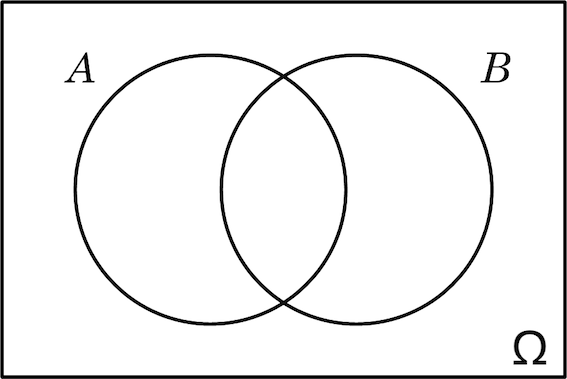
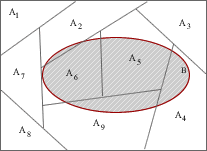

```{r setup, include=FALSE}
knitr::opts_chunk$set(echo = TRUE, comment = NA)
```

# Conceptos básicos

## Experimento aleatorio

<l class = "definition">Experimento aleatorio. </l> Experimento que efectuado en las mismas condiciones puede dar lugar a resultados diferentes

<l class = "definition">Suceso elemental. </l> Cada uno de los posibles resultados del experimento aleatorio

<l class = "definition">Espacio muestral. </l> Conjunto $\Omega$ formado por todos los sucesos elementales del experimento aleatorio

<div class = "example">
**Ejemplo**

Lanzar una moneda es un experimento aleatorio

Los sucesos elementales son: sacar cara ($C$) y sacar cruz ($+$)

El espacio muestral de este experimento aleatorio es $\Omega = \{C,+\}$
</div>

## Sucesos

<l class = "definition">Suceso. </l> Subconjunto del espacio muestral

<l class = "definition">Suceso total o seguro. </l> $\Omega$

<l class = "definition">Suceso vacío o imposible. </l> $\emptyset$

<div class = "example">
**Ejemplo**

Lanzar un dado es un experimento aleatorio

Algunos sucesos podrían ser: sacar número par ($\{2,4,6\}$), sacar mayor que 4 ($\{5,6\}$), sacar número múltiplo de 3 ($\{3,6\}$)...

El suceso total de este experimento aleatorio es $\Omega = \{1,2,3,4,5,6\}$

Un ejemplo de suceso imposible de este experimento aleatorio es $\emptyset = \{7\}$ (sacar 7)
</div>


## Sucesos

<l class = "prop">Operaciones con sucesos. </l> Sean $A,B\subseteq \Omega$ sucesos. Entonces,

- $A\cup B$ es el suceso unión (resultados pertenecen a $A$, o a $B$, o a ambos)
- $A\cap B$ es el suceso intersección (resultados pertenecen a $A$ y $B$)
- $A^c$ es el suceso complementario (resultados que no pertenecen a $A$)
- $A-B = A\cap B^c$ es el suceso diferencia (resultados que pertenecen a $A$ pero no a $B$)

<l class = "definition">Sucesos incompatibles. </l> Si $A\cap B = \emptyset$

## Sucesos

<l class = "prop">Propiedades de los sucesos. </l>

- Conmutativa: $$A\cup B = B\cup A$$ $$A\cap B = B\cap A$$
- Asociativa: $$A\cup(B\cup C) = (A\cup B)\cup C$$ $$A\cap(B\cap C) = (A\cap B)\cap C$$

## Sucesos

<l class = "prop">Propiedades de los sucesos. </l>

- Distributiva: $$A\cap(B\cup C) = (A\cap B)\cup (A\cap C)$$ $$A\cup(B\cap C) = (A\cup B)\cap (A\cup C)$$
- Doble complementario: $(A^c)^c = A$
- Leyes de De Morgan: $$(A\cup B)^c = A^c\cap B^c$$ $$(A\cap B)^c = A^c\cup B^c$$

## Sucesos

<div class = "example">
**Ejemplo**

$\Omega = \{\text{conejos de la granja}\}$ 
$A = \{\text{conejos hembra}\}$
$B = \{\text{conejos con dos colores}\}$

$A\cup B = \{\text{Conejos que son hembra o tienen dos colores}\}$
$A\cap B = \{\text{Conejos que son hembra y tienen dos colores}\}$
$A^c = \{\text{Conejos que no son hembra}\}= \{\text{Conejos que son macho}\}$
$A-B = \{\text{Conejos que son hembra y no tienen dos colores}\}$
$B- A = \{\text{Conejos que tienen dos colores y son macho}\}$

No son incompatibles
</div>

## Probabilidad

<l class = "definition">Probabilidad de un suceso. </l>Número entre 0 y 1 (ambos incluidos) que mide la expectativa de que se dé este suceso

<div class = "example">
**Ejemplo**

- La probabilidad de sacar un 6 al lanzar un dado estándar no trucado es $\frac{1}{6}$
- La probabilidad de sacar un 6 al lanzar un dado de 4 caras es $0$
- La probabilidad de sacar un 6 al lanzar un dado de 20 caras es $\frac{1}{20}$

</div>

<div class = "aligncenter">

</div>


## Probabilidad

<l class = "definition">Probabilidad. </l> Sea $\Omega$ el espacio muestral de un experimento aleatorio. Suponiendo que $\Omega$ es **finito**, una probabilidad sobre $\Omega$ es una aplicación $$p: \mathcal{P}(\Omega)\longrightarrow [0,1]$$ que satisface

- $0\le p(A)\le 1 \ \forall A\in\mathcal{P}(\Omega)$
- $p(\Omega) = 1$
- Si $\{A_1,\dots,A_n\}$ son sucesos incompatibles dos a dos ($A_i\cap A_j=\emptyset \ \forall i\ne j$), entonces $$p(A_1\cup\cdots \cup A_n)=p(A_1)+\cdots+p(A_n)$$

<l class = "important">Notación: </l> Si $a\in\Omega$, escribiremos $p(a)$ en vez de $p(\{a\})$

## Probabilidad

<l class = "prop">Propiedades. </l>

- $p(\emptyset) = 0$
- $p(A-B) = p(A)-p(A\cap B)$
- Si $B\subseteq A$, entonces $0\le p(B)\le p(A)$
- $p(A^c) = 1-p(A)$
- $p(A\cup B) = p(A)+p(B)-p(A\cap B)$

## Probabilidad

<l class = "prop">Propiedades. </l>

- $$p(A\cup B\cup C) =$$ $$p(A)+p(B)+p(C)-p(A\cap B)-p(A\cap C)-p(B\cap C)+p(A\cap B\cap C)$$
- Si $A = \{a_1,\dots,a_k\}$, entonces $p(A) = p(a_1)+\cdots+p(a_k)$
- Si todos los sucesos elementales tienen la misma probabilidad, cada uno tiene probabilidad $\frac{1}{|\Omega|}$ y, por tanto $$p(A) = \frac{|A|}{|\Omega|} = \frac{\text{# casos favorables}}{\text{# casos posibles}}$$

## Probabilidad condicionada

<l class = "definition">Probabilidad condicionada. </l> Dados $A,B$ sucesos, con $p(B)>0$, la probabilidad $p(A|B)$ de $A$ condicionada a $B$ es la probabilidad de que 

- pase $A$ suponiendo que pasa $B$
- si pasa $B$, entonces pase $A$
- que un resultado de $B$ también pertenezca a $A$

$$p(A|B) = \frac{p(A\cap B)}{p(B)}$$

## Probabilidad condicionada

<l class = "important">¡Alerta! </l> Cabe distinguir entre

- $p(A\cap B):$ probabilidad de $A$ y $B$
- $p(A|B):$ probabilidad de que si pasa $B$ entonces pase $A$. 

En $p(A|B)$ restringimos el espacio muestral a $B$.

## Probabilidad condicionada

<l class = "prop">Proposición. </l> Sea $A\subseteq \Omega$ un acontecimiento tal que $p(A)>0$. Entonces $$p(\cdot |A): \mathcal{P}(\Omega)\longrightarrow [0,1]$$ tal que $B\mapsto p(B|A)$ satisface las propiedades de probabilidad

Lo que nos dice este resultado es que la probabilidad condicionada es, en efecto, una probabilidad.


## Teorema de la probabilidad total

<l class = "prop">Teorema. </l> $A,B$ sucesos. Entonces,

$$p(B) = p(B\cap A)+p(B\cap A^c) = p(A)\cdot p(B|A)+p(A^c)\cdot p(B|A^c)$$

<div class = "aligncenter">

</div>


## Teorema de la probabilidad total

<l class = "definition"> Partición del espacio muestral. </l>Los sucesos $A_1,\dots, A_n$ forman una partición del espacio muestral $\Omega$ de un determinado experimento aleatorio,  si se cumple 

- $A_1\cup\cdots \cup A_n = \Omega$
- $A_1,\dots,A_n$ son incompatibles dos a dos $(A_i\cap A_j = \emptyset)$

<l class = "prop">Teorema. </l> $A_1,\dots, A_n$ partición de $\Omega$ y $B$ suceso cualquiera. Entonces,

$$p(B) = p(B\cap A_1)+\cdots+p(B\cap A_n) = p(A_1)\cdot p(B|A_1)+\cdots+p(A_n)\cdot p(B|A_n)$$

<div class = "aligncenter">

</div>

## Diagnósticos

En un diagnóstico de una cierta condición, tenemos dos tipos de suceso:

- $P:$ test da positivo
- $S:$ sujeto satisface la condición

Entonces,

- <l class = "definition">Falso positivo. </l> $P\cap S^c$ (el test da positivo, pero la condición no se da)
- <l class = "definition">Falso negativo. </l> $P^c\cap S$ (el test da negativo, pero sí se da la condición)
- <l class = "definition">Coeficiente de falso positivo. </l> $p(P|S^c)$
- <l class = "definition">Coeficiente de falso negativo. </l> $p(P^c|S)$

## Fórmula de Bayes

<l class = "prop">Teorema de Bayes. </l> $A,B$ sucesos. Si $p(B)>0$, entonces

$$p(A|B) = \frac{p(A)\cdot p(B|A)}{p(B)}=\frac{p(A)\cdot p(B|A)}{p(A)\cdot p(B|A)+p(A^c)\cdot p(B|A^c)}$$

<l class = "prop">Teorema de Bayes. </l> $A_1,\dots,A_n$ partición de $\Omega$. Sea $B$ suceso tal que $p(B)>0$. Entonces

$$p(A_i|B) = \frac{p(A_i)\cdot p(B|A_i)}{p(B)}=\frac{p(A_i)\cdot p(B|A_i)}{p(A_1)\cdot p(B|A_1)+\cdots+p(A_n)\cdot p(B|A_n)}$$

## Sucesos independientes

<l class = "definition">Sucesos independientes. </l> Dados $A,B$ sucesos, son independientes si $p(A\cap B) = p(A)\cdot p(B)$

<l class = "definition">Sucesos independientes. </l> Dados $A_1,\dots,A_n$, son independientes cuando para toda subfamilia $A_{i_1},\dots,A_{i_k}$, $$p(A_{i_1}\cap\dots\cap A_{i_k})=p(A_{i_1})\cdots p(A_{i_k})$$


## Sucesos independientes

<l class = "prop">Proposición. </l> Dados dos sucesos $A,B$ con $p(A),p(B)>0$ son equivalentes

- $A$ y $B$ son independientes
- $p(A|B) = p(A)$
- $p(B|A) = p(B)$
- $A^c$ y $B$ son independientes
- $A$ y $B^c$ son independientes
- $A^c$ y $B^c$ son independientes

# Variables aleatorias

## Variable aleatoria

<l class = "definition">Variable aleatoria. </l> Una variable aleatoria (v.a.) sobre $\Omega$ es una aplicación $$X: \Omega\longrightarrow \mathbb{R}$$ que asigna a cada suceso elemental $\omega$ un número real $X(\omega)$ 

Puede entenderse como una descripción numérica de los resultados de un experimento aleatorio

<l class = "definition">Dominio de una variable aleatoria. </l> $D_X$, es el conjunto de los valores que puede tomar

## Sucesos de variables aleatorias

Una variable aleatoria puede definir sucesos, de los cuales queremos conocer la probabilidad $p$

- $p(X=a) = p(\{\omega\in\Omega \ |\  X(\omega) = a\})$
- $p(X<b) = p(\{\omega\in\Omega \ |\  X(\omega) < b\})$
- $p(a\le X) = p(\{\omega\in\Omega \ |\  a\le X(\omega)\})$
- $p(a< X\le b) = p(\{\omega\in\Omega \ |\  a< X(\omega) \le b\})$
- $\vdots$
- $p(X\in A) = p(\{\omega\in\Omega \ |\  X(\omega)\in A\})$
- Para la unión utilizaremos $o$: $p(X>b\ o\ X<a)$
- Para la intersección utilizaremos una coma $,$:$\ p(X>b,\ X<a)$

## Función de distribución

<l class = "definition">Función de distribución de la v.a. $X$.</l> Es una función  $$F:\mathbb{R}\longrightarrow [0,1]$$ definida por $F(x)=p(X\le x)$

## Función de distribución

<l class = "prop">Propiedades básicas.</l>

- $0\le F(x)\le 1$
- $F$ es creciente
- $F$ es continua por la derecha: $\lim_{x\rightarrow a^+}F(X):= \lim_{t\rightarrow 0^+}F(a+t)=F(a)$, pero $F$ no tiene por qué ser continua
- $\lim_{x\rightarrow +\infty} F(X)= 1$, $\lim_{x\rightarrow -\infty} F(X)= 0$

Toda función $F$ que satisfaga estas propiedades es la distribución de alguna v.a. $X$ 

## Función de distribución 

Sea $F$ una función de distribución de una v.a. $X$ y digamos $$F(a^-)=\lim_{x\rightarrow a^-}F(x)$$

- $p(X\le a)=F(a)$
- $p(X<a)=\lim_{b\rightarrow a,\  b<a}p(X\le b) = \lim_{b\rightarrow a,\  b<a} F(b) = F(a^-)$
- $p(X=a) = p(X\le a)-p(X<a)=F(a)-F(a^-)$
- $p(a\le X\le b) = p(X\le b)-p(X< a)=F(b)-F(a^-)$
- $\vdots$

## Cuantiles

<l class = "definition">Cuantil de orden $p$ de una v.a. $X$.</l> Es el $x_p\in\mathbb{R}$ más pequeño tal que $F(x_p)\ge p$

Nótese que la mediana es el cuantil de orden 0.5

## Variables aleatorias independientes

<l class = "definition">Variables independientes.</l> $X_1,\dots,X_n$ son v.a. independientes cuando, para cada $a_1,\dots,a_n\in \mathbb{R}$, los sucesos $$X_1\le a_1,\dots,X_n\le a_n$$ son independientes

- Si $X,Y$ independientes, entonces $$p(X\le a, Y\le b) = p(X\le a)\cdot p(Y\le b) = F_X(a)\cdot F_Y(b)$$

# Variables aleatorias discretas

## Variable aleatoria discreta

<l class = "definition">Variable aleatoria discreta.</l> Una v.a. $X:\Omega\longrightarrow \mathbb{R}$ es discreta cuando $D_X$ es finito o un subconjunto de $\mathbb{N}$ 

<l class = "definition">Función de densidad.</l> Es la función $f:\mathbb{R}\longrightarrow[0,1]$ definida por $$f(x) = p(X=x)$$

Nótese que $f(x)=0$ si $x\not\in D_X$. Por tanto, interpretaremos la función de densidad como la función $$f:D_X\longrightarrow [0,1]$$

## Función de densidad

<l class = "prop">Propiedades.</l>

- $0\le f(x)\le 1$
- $f(x) = 0$ si $x\not\in D_X$
- $\sum_{x\in D_X} f(x) = 1$
- $F(a) = p(X\le a)=\sum_{x\in D_X,\ x\le a}f(x)$
- $p(X\in A)= \sum_{x\in A}f(x)$

## Función de densidad

<l class = "important"> ¡Ojo!</l> ¿Qué ocurre con $\sum_{x\in A}f(x)$ si $A\subseteq\mathbb{N}$ no es finito?

Al ser subconjunto de los naturales, $\mathbb{N}$, los elementos de $A$ pueden ordenarse $$A=\{x_0,x_1,\dots,x_n,\dots\}$$

Llamemos $$S_n = \sum_{i\le n}f(x_i)$$

Entonces, $$\sum_{x\in A}f(x):=\lim_{n\rightarrow +\infty}S_n$$

## Función de distribución vs. densidad

Sea $X$ v.a. discreta:

- Conocida la densidad $f$ conocemos la distribución $F$ $$F(a) = \sum_{x\in D_X,\ x\le a}f(x)$$
- Conocida la distribución $F$, conocemos la densidad $f$: si $a_0\in D_X$ es el elemento inmediantamente más pequeño que $a$, $$F(a)= p(X\le a)=p(X\le a_0)+p(X=a)= F(a_0)+f(a)\Rightarrow$$$$f(a)=F(a)-F(a_0)$$

## Esperanza

<l class = "definition">Esperanza de una v.a. discreta.</l> Sea $f:D_X\longrightarrow[0,1]$ la densidad de $X$, entonces la esperanza respecto de la densidad es la suma ponderada de los elementos de $D_X$, multiplicando cada elemento $x$ de $D_X$ por su probabilidad, $$E(X) = \sum_{x\in D_X}x\cdot f(x)$$

Si $g:D_X\longrightarrow \mathbb{R}$ es una aplicación $$E(g(X))=\sum_{x\in D_X}g(x)\cdot f(x)$$

## Esperanza

<l class = "prop">Teorema.</l> Sean $\epsilon$ un experimento aleatorio con espacio muestral $\Omega$ y $X:\Omega\longrightarrow\mathbb{R}$ una v.a. discreta. Sea $\bar{X}_n$ la v.a. «repetir el experimento $\epsilon$ $n$ veces y calcular la media de las imágenes de $X$ de los $n$ resultados». Entonces, $$p(\lim_{n\rightarrow \infty}\bar{X}_n=E(X))=1$$

Básicamente, $E(X)$ es el límite de la media de los valores de $X$ si efectuamos el experimento $n$ veces y hacemos $n\rightarrow \infty$

## Esperanza

<l class = "prop">Propiedades.</l>

- $E(b)=b,\  b\in\mathbb{R}$
- $E(aX+b)=aE(X)+b$
- $E(X+Y)=E(X)+E(Y)$
- Si $X\le Y$, entonces $E(X)\le E(Y)$
- Si $a<X<b$, entonces $a<E(X)<b$
- Si $X\ge 0$, entonces $E(X)\ge 0$
- Si $g(X)\le h(X)$, entonces $E(g(X))\le E(h(X))$
- <l class = "important">¡Cuidado!</l> En general, $E(g(X))\ne g(E(X))$
- <l class = "important">¡Cuidado!</l> $E$ solo tiene sentido si la suma que la define es convergente, $<\infty$

## Varianza

<l class = "definition">Varianza de una v.a. discreta.</l> Sea $f:D_X\longrightarrow[0,1]$ la densidad de $X$, entonces la varianza respecto de la densidad es el valor esperado de la diferencia al cuadrado entre $X$ y su valor medio $E(X)$, $$Var(X)= E((X-E(X))^2) $$

La varianza mide como de variados son los resultados de $X$ respecto de la media

<div class = "exercise"> **Ejercicio.** Demostrar la siguiente igualdad. $$Var(X)= E(X^2)-(E(X))^2$$</div>

## Varianza

Si $X$ es una v.a. discreta y $g:D_X\longrightarrow \mathbb{R}$ una función, $$Var(g(X))=E((g(X)-E(g(X)))^2)=E(g(X)^2)-(E(g(X)))^2$$

## Varianza

<l class = "prop">Propiedades.</l>

- $Var(b)=0,\ \forall b\in\mathbb{R}$
- $Var(aX+b)=a^2Var(X)$
- Si $X,Y$ son v.a. independientes, $Var(X+Y)=Var(X)+Var(Y)$ 

## Desviación típica

<l class = "definition">Desviación típica de una v.a. discreta.</l> Sea $f:D_X\longrightarrow[0,1]$ la densidad de $X$, entonces la desviación típica respecto de la densidad es $$\sigma(X)=\sqrt{Var(X)}$$

Las unidades de la varianza son las de $X$ al cuadrado. En cambio, las de la desviación típica son las mismas unidades que las de $X$

Si $X$ es una v.a. discreta y $g:D_X\longrightarrow \mathbb{R}$ una función, $$\sigma(g(X))=\sqrt{Var(g(X))}$$

## Desviación típica

<l class = "prop">Propiedades.</l>

- $\sigma(b)=0,\ \forall b\in\mathbb{R}$
- $\sigma(aX+b)=a\sigma(X)$

# Distribuciones de probabilidad

## Distribución de probabilidad

<l class = "definition">[Distribución de probabilidad](https://es.wikipedia.org/wiki/Distribución_de_probabilidad).</l> En teoría de la probabilidad y estadística, la distribución de probabilidad de una variable aleatoria es una función que asigna a cada suceso definido sobre la variable la probabilidad de que dicho suceso ocurra.

## Distribuciones en `R`

Dada cualquier variable aleatoria, `va`, `R` nos da cuatro funciones para poder trabajar con ellas:

- `dva(x,...)`: Función de densidad o de probabilidad $f(x)$ de la variable aleatoria para el valor  $x$ del dominio de definición.
- `pva(x,...)`: Función de distribución $F(x)$ de la variable aleatoria para el valor $x$ del dominio de definición.
- `qva(p,...)`: Cuantil $p$-ésimo de la variable aleatoria (el valor de $x$ más pequeño tal que $F(x)\geq p$).
- `rva(n,...)`: Generador de $n$ observaciones siguiendo la distribución de la variable aleatoria.

## Distribuciones en `Python`

Dada cualquier variable aleatoria, en `Python` tenemos las mismas cuatro funciones, sin que su nombre dependa de la misma:

- `pmf(k,...)` o `pdf(x,...)`: Función de probabilidad $f(k)$ o de densidad $f(x)$ de la variable aleatoria para los valores $k$ o $x$ del dominio.
- `cdf(x,...)`: Función de distribución $F(x)$ de la variable aleatoria para el valor $k$ del dominio.
- `ppf(p,...)`: Cuantil $p$-ésimo de la variable aleatoria (el valor de $x$ más pequeño tal que $F(x)\geq p$).
- `rvs(size,...)`: Generador de $size$ observaciones siguiendo la distribución de la variable aleatoria.


# Distribuciones discretas más conocidas

## Distribuciones discretas

- [Bernoulli](https://es.wikipedia.org/wiki/Distribución_de_Bernoulli)
- [Binomial](https://es.wikipedia.org/wiki/Distribución_binomial)
- [Geométrica](https://es.wikipedia.org/wiki/Distribución_geométrica)
- [Hipergeométrica](https://es.wikipedia.org/wiki/Distribución_hipergeométrica)
- [Poisson](https://es.wikipedia.org/wiki/Distribución_de_Poisson)

## Distribución de Bernoulli

Si $X$ es variable aleatoria que mide el "número de éxitos" y se realiza un único experimento con dos posibles resultados (éxito, que toma valor 1, o fracaso, que toma valor 0), diremos que $X$ se distribuye como una Bernoulli con parámetro $p$

$$X\sim \text{Be}(p)$$

donde $p$ es la probabilidad de éxito y $q = 1-p$ es la probabilidad de fracaso.

- El **dominio** de $X$ será $D_X = \{0,1\}$
- La **función de densidad** vendrá dada por $$f(k) = p^k(1-p)^{1-k} =  \left\{
\begin{array}{rl}
     p & \text{si } k=1 
  \\ 1-p & \text{si } k=0
  \\ 0 & \text{en cualquier otro caso}
\end{array}
\right.$$

## Distribución de Bernoulli

- La **función de distribución** vendrá dada por $$F(x) = \left\{
\begin{array}{rl}
     0 & \text{si } x<0 
  \\ 1-p & \text{si } 0\le x<1
  \\ 1 & \text{si } x\ge 1
\end{array}
\right.$$
- **Esperanza** $E(X) = p$
- **Varianza** $Var(X) = pq$

## Distribución de Bernoulli

El código de la distribución de Beroulli:

- En `R` tenemos las funciones del paquete `Rlab`: `dbenr(x,prob), pbenr(q,prob), qbenr(p,prob), rbenr(n, prob)` donde `prob` es la probabilidad de éxito.
- En `Python` tenemos las funciones del paquete `scipy.stats.bernoulli`: `pmf(k,p), cdf(k,p), ppf(q,p), rvs(p, size)` donde `p` es la probabilidad de éxito.

## Distribución Binomial

Si $X$ es variable aleatoria que mide el "número de éxitos" y se realizan $n$ ensayos de Bernoulli independientes entre sí, diremos que $X$ se distribuye como una Binomial con parámetros $n$ y $p$

$$X\sim \text{B}(n,p)$$

donde $p$ es la probabilidad de éxito y $q = 1-p$ es la probabilidad de fracaso

- El **dominio** de $X$ será $D_X= \{0,1,2,\dots,n\}$
- La **función de densidad** vendrá dada por $$f(k) = {n\choose k}p^k(1-p)^{n-k} $$

## Distribución Binomial

- La **función de distribución** vendrá dada por $$F(x) = \left\{
\begin{array}{cl}
     0 & \text{si } x<0 
  \\ \sum_{k=0}^xf(k) & \text{si } 0\le x<n
  \\ 1 & \text{si } x\ge n
\end{array}
\right.$$
- **Esperanza** $E(X) = np$
- **Varianza** $Var(X) = npq$

<l class = "important">Atención.</l> Fijaos que la distribución de Bernoulli es un caso particular de la Binomial. Basta tomar $n=1$ y tendremos que $X\sim \text{Be}(p)$ y $X\sim\text{B}(1,p)$ son equivalentes.

## Distribución Binomial

```{r, echo = FALSE}
par(mfrow = c(1,2))
plot(dbinom(1:50,50,0.5),col = "purple", xlab = "", ylab = "", main = "Función de probabilidad de una B(50,0.5)")
plot(pbinom(1:50,50,0.5),col = "purple", xlab = "", ylab = "", main = "Función de distribución de una B(50,0.5)")
par(mfrow= c(1,1))

```

## Distribución Geométrica

Si $X$ es variable aleatoria que mide el "número de repeticiones independientes del experimento hasta haber conseguido éxito", diremos que $X$ se distribuye como una Geométrica con parámetro $p$

$$X\sim \text{Ge}(p)$$
donde $p$ es la probabilidad de éxito y $q = 1-p$ es la probabilidad de fracaso

- El **dominio** de $X$ será $D_X = \{0,1,2,\dots\}$ o bien $D_X = \{1,2,\dots\}$ en función de si empieza en 0 o en 1, respectivamente

- La **función de densidad** vendrá dada por $$f(k) = (1-p)^{k}p \qquad\text{ si empieza en 0}$$
$$f(k) = (1-p)^{k-1}p \qquad\text{ si empieza en 1}$$

## Distribución Geométrica

- La **función de distribución** vendrá dada por $$F(x) = \left\{
\begin{array}{cl}
     0 & \text{si } x<0 
  \\ 1-(1-p)^{k+1} & \text{si } k\le x<k+1,\ k\in\mathbb{N}
\end{array}
\right.$$ 
- **Esperanza** $E(X) = \frac{1-p}{p}$ si empieza en 0 y E$(X) = \frac{1}{p}$ si empieza en 1
- **Varianza** $Var(X) = \frac{1-p}{p^2}$
- <l class = "prop">Propiedad de la falta de memoria.</l> Si $X$ es una v.a. $\text{Ge}(p)$, entonces, $$p\{X\ge m+n:\ X\ge n\} = p\{X\ge m\}\ \forall m,n=0,1,\dots$$

## Distribución Geométrica

```{r, echo = FALSE}
par(mfrow = c(1,2))
plot(dgeom(1:20,0.5),col = "purple", xlab = "", ylab = "", main = "Función de probabilidad de una Ge(0.5)")
plot(pgeom(1:20,0.5),col = "purple", xlab = "", ylab = "", main = "Función de distribución de una Ge(0.5)")
par(mfrow= c(1,1))

```

## Distribución Hipergeométrica

Consideremos el experimento "extraer a la vez (o una detrás de otra, sin retornarlos) $n$ objetos donde hay $N$ de tipo A y $M$ de tipo B". Si $X$ es variable aleatoria que mide el "número de objetos del tipo A", diremos que $X$ se distribuye como una Hipergeométrica con parámetros $N,M,n$
$$X\sim \text{H}(N,M,n)$$

- El **dominio** de $X$ será $D_X = \{0,1,2,\dots,N\}$ (en general)
- La **función de densidad** vendrá dada por $$f(k) = \frac{{N\choose k}{M\choose n-k}}{N+M\choose n}$$

## Distribución Hipergeométrica

- La **función de distribución** vendrá dada por $$F(x) = \left\{
\begin{array}{cl}
     0 & \text{si } x<0 
  \\ \sum_{k=0}^xf(k) & \text{si } 0\le x<n
  \\ 1 & \text{si } x\ge n
\end{array}
\right.$$
- **Esperanza** $E(X) = \frac{nN}{N+M}$ 
- **Varianza** $Var(X) = \frac{nNM}{(N+M)^2}\cdot\frac{N+M-n}{N+M-1}$

## Distribución Hipergeométrica

```{r, echo = FALSE}
par(mfrow = c(1,2))
plot(dhyper(1:30,10,20,10),col = "purple", xlab = "", ylab = "", main = "Función de probabilidad de una H(20,10,30)")
plot(phyper(1:30,10,20,10),col = "purple", xlab = "", ylab = "", main = "Función de distribución de una H(20,10,30)")
par(mfrow= c(1,1))

```

## Distribución de Poisson

Si $X$ es variable aleatoria que mide el "número de eventos en un cierto intervalo de tiempo", diremos que $X$ se distribuye como una Poisson con parámetro $\lambda$

$$X\sim \text{Po}(\lambda)$$
donde $\lambda$ representa el número de veces que se espera que ocurra el evento durante un intervalo dado

- El **dominio** de $X$ será $D_X = \{0,1,2,\dots\}$

- La **función de densidad** vendrá dada por $$f(k) = \frac{e^{-\lambda}\lambda^k}{k!}$$

## Distribución de Poisson
 
- La **función de distribución** vendrá dada por $$F(x) = \left\{
\begin{array}{cl}
     0 & \text{si } x<0 
  \\ \sum_{k=0}^xf(k) & \text{si } 0\le x<n
  \\ 1 & \text{si } x\ge n
\end{array}
\right.$$ 
- **Esperanza** $E(X) = \lambda$
- **Varianza** $Var(X) = \lambda$


## Procesos de Poisson

<l class = "definition">Proceso de Poisson.</l> La v.a. discreta $X_t$ que cuenta el número de objetos en una región (intervalo de tiempo, espacio...) de medida $t$, con las siguientes características:

- El número medio de objetos en una región es proporcional a la medida.
- Los números de objetos en regiones distintas son independientes
- La probabilidad de encontrar más de un objeto en una región tiende a 0 si la medida de la región tiende a 0

Entonces, para cada $t$, $X_t$ es de Poisson con parámetro $\lambda_t$. Ahora bien, como por un lado $\lambda_t$ es el número medio de objetos en la región de medida $t$ y, por otro, el número medio de objetos en una región es proporcional a la medida

$$\lambda_{x\cdot t}=x\cdot \lambda_t \text{ y, en particular, } \lambda_t = t\cdot \lambda_1$$

## Distribución de Poisson

<l class = "prop">Propiedades.</l>

- Si $X_1,\dots,X_n$ son v.a. de Poisson independientes, con cada $X_i$ con parámetro $\lambda_i$, entonces $X_1+\cdots+X_n$ es una v.a. de Poisson con parámetro $\lambda_1+\cdots+\lambda_n$
- $X_1,X_2$ v.a. de Poisson independientes, con cada $X_i$ con parámetro $\lambda_i$, entonces la probabilidad condicionada $p(X_1=k \ :\ X_1+X_2=n )$ es binomial de parámetros $n$ y $p = \frac{\lambda_1}{\lambda_1+\lambda_2}$

## Distribución de Poisson

```{r, echo = FALSE}
par(mfrow = c(1,2))
plot(dpois(1:20,2),col = "purple", xlab = "", ylab = "", main = "Función de probabilidad de una Po(2)")
plot(ppois(1:20,2),col = "purple", xlab = "", ylab = "", main = "Función de distribución de una Po(2)")
par(mfrow= c(1,1))

```

## Distribuciones discretas en R

R conoce las distribuciones de probabilidad más importantes.

Distribución |  Instrucción  |  Parámetros                                
--------------------|--------------------|--------------------
Binomial | `binom` | tamaño de la muestra $n$ y probabilidad de éxito $p$
Geométrica | `geom` | probabilidad de éxito $p$
Hipergeométrica | `hyper` | $N,M,n$
Poisson | `pois` | esperanza $\lambda$

# Variables aleatorias continuas

## Variable aleatoria continua

<l class = "definition">Variable aleatoria continua.</l> Una v.a. $X:\Omega\longrightarrow\mathbb{R}$ es continua cuando su función de distribución $F_X:\mathbb{R}\longrightarrow[0,1]$ es continua

En este caso, $F_X(x)=F_X(x^-)$ y, por este motivo, $$p(X=x)=0\ \forall x\in\mathbb{R}$$
pero esto no significa que sean sucesos imposibles

## Función de densidad

<l class = "definition">Función de densidad.</l> Función $f:\mathbb{R}\longrightarrow\mathbb{R}$ que satisface 

- $f(x)\ge 0\ \forall x\in\mathbb{R}$
- $\int_{-\infty}^{+\infty}f(t)dt=1$

Una función de densidad puede tener puntos de discontinuidad

## Variable aleatoria continua

Toda variable aleatoria $X$ con función de distribución 

$$F(x)=\int_{-\infty}^{x}f(t)dt\ \forall x\in\mathbb{R}$$ para cualquier densidad $f$ es una v.a. continua

Diremos entonces que $f$ es la función de densidad de $X$

A partir de ahora, considerareos solamente las v.a. $X$ continuas que tienen función de densidad

## Variable aleatoria continua

<l class = "prop">Propiedades.</l>

- $F_X$ es continua
- El dominio de $X$ es $D_X=\{x:f(x)>0\}$
- Si $A\subset \mathbb{R}$ es un intervalo con extremos $a<b$, entonces $$p(X\in A)=\int_a^b f_X(x)dx$$

## Esperanza

<l class = "definition">Esperanza de una v.a. continua.</l> Sea $X$ v.a. continua con densidad $f_X$. La esperanza de $X$ es $$E(X)=\int_{-\infty}^{+\infty}x\cdot f_X(x)dx$$

Si el dominio $D_X$ de $X$ es un intervalo de extremos $a<b$, entonces $$E(X)=\int_a^b x\cdot f_X(x)dx$$

$E(X)$ es casi seguramente el límite de la media de los valores de $X$ si efectuamos el experimento $n$ veces y hacemos $n\rightarrow \infty$

## Esperanza

Sea $g:D_X\longrightarrow \mathbb{R}$ una función continua. Entonces, 

$$E(g(X)) = \int_{-\infty}^{+\infty}g(x)\cdot f_X(x)dx$$

Si el dominio $D_X$ de $X$ es un intervalo de extremos $a<b$, entonces $$E(g(X))=\int_a^b g(x)\cdot f_X(x)dx$$

## Varianza

<l class = "definition">Varianza de una v.a. continua.</l> Como en el caso discreto, $$Var(X)=E((X-E(X))^2)$$

y se puede demostrar que

$$Var(X)=E(X^2)-(E(X))^2$$

## Desviación típica

<l class = "definition">Desviación típica de una v.a. continua.</l> Como en el caso discreto, $$\sigma = \sqrt{Var(X)}$$

# Distribuciones continuas más conocidas

## Distribuciones continuas

- [Uniforme](https://es.wikipedia.org/wiki/Distribución_uniforme_continua)
- [Exponencial](https://es.wikipedia.org/wiki/Distribución_exponencial)
- [Normal](https://es.wikipedia.org/wiki/Distribución_normal)
- [Khi cuadrado](https://es.wikipedia.org/wiki/Distribución_χ²)
- [t de Student](https://es.wikipedia.org/wiki/Distribución_t_de_Student)
- [F de Fisher](https://es.wikipedia.org/wiki/Distribución_F)


## Distribución Uniforme

Una v.a. continua $X$ tiene distribución uniforme sobre el intervalo real $[a,b]$ con $a<b$, $X\sim\text{U}(a,b)$ si su función de densidad es $$f_X(x)=\left\{
\begin{array}{rl}
     \frac{1}{b-a} & \text{si } a\le x\le b
  \\ 0 & \text{en cualquier otro caso}
\end{array}
\right.$$

Modela el elegir un elemento del intervalo $[a,b]$ de manera equiprobable

## Distribución Uniforme

- El **dominio** de $X$ será $D_X = [a,b]$

- La **función de distribución** vendrá dada por $$F_X(x)=\left\{
\begin{array}{rl}
    0 & \text{si } x<a
  \\ \frac{x-a}{b-a} & \text{si } a\le x< b
  \\ 1 & \text{si } x\ge b
\end{array}
\right.$$

- **Esperanza** $E(X) = \frac{a+b}{2}$
- **Varianza** $Var(X) = \frac{(b-a)^2}{12}$

## Distribución Uniforme

```{r, echo = FALSE}
plot(dunif(1:20,min = 0, max = 20),col = "purple", xlab = "", ylab = "", main = "Función de densidad de una U(0,20)", type = "o")
```

## Distribución Exponencial

Una v.a. $X$ tiene distribución exponencial de parámetro $\lambda$, $X\sim\text{Exp}(\lambda)$, si su función de densidad es $$f_X(x)=\left\{
\begin{array}{rl}
     0 & \text{si }  x\le 0
  \\ \lambda\cdot e^{-\lambda x} & \text{si }x>0
\end{array}
\right.$$

<l class = "prop">Teorema. </l> Si tenemos un proceso de Poisson de parámetro $\lambda$ por unidad de tiempo, el tiempo que pasa entre dos sucesos consecutivos es una v.a. $\text{Exp}(\lambda)$

<l class = "prop">Propiedad de la pérdida de memoria. </l> Si $X$ es v.a. $\text{Exp}(\lambda)$, entonces $$p(X>s+t\ :\ X>s)=p(X>t)\ \forall s,t>0$$

## Distribución Exponencial

- El **dominio** de $X$ será $D_X = [0,\infty)$

- La **función de distribución** vendrá dada por $$F_X(x)=\left\{
\begin{array}{rl}
    0 & \text{si } x\le 0
  \\ 1-e^{-\lambda x} & \text{si } x>0
\end{array}
\right.$$

- **Esperanza** $E(X) = \frac{1}{\lambda}$
- **Varianza** $Var(X) = \frac{1}{\lambda^2}$

## Distribución Exponencial

```{r, echo = FALSE}
plot(dexp(1:20,0.2),col = "purple", xlab = "", ylab = "", main = "Función de densidad de una Exp(0.2)", type = "o")
```

## Distribución Normal

Una v.a. $X$ tiene distribución normal o gaussiana de parámetros $\mu$ y $\sigma$, $X\sim\mathcal{N}(\mu,\sigma)$ si su función de densidad es $$f_X(x)=\frac{1}{\sqrt{2\pi}\sigma}e^{-\frac{(x-\mu)^2}{2\sigma^2}}\quad \forall x\in\mathbb{R}$$

La gráfica de $f_X$ es conocida como la <l class = "definition">Campana de Gauss</l>

Cuando $\mu = 0$ y $\sigma = 1$, diremos que la v.a. $X$ es <l class = "definition">estándar</l> y la indicaremos usualmente como $Z$, la cual tendrá función de densidad
$$f_Z(z)=\frac{1}{\sqrt{2\pi}}e^{-\frac{z^2}{2}}\quad \forall z\in\mathbb{R}$$

## Distribución Normal

<l class = "prop">Propiedades.</l>

- $f_X$ es simétrica respecto de $x=\mu$: $$f_X(\mu-x)=f_X(\mu+x)$$
- $f_X$ alcanza su máximo en $x=\mu$
- En particular, si $Z\sim\mathcal{N}(0,1)$, entonces $f_Z(-z)=f_Z(z)$ y alcanza su máximo en $z=0$

## Distribución Normal

<l class = "prop">Propiedades.</l>

- La simetría hace iguales las áreas a la izquierda de $\mu-x$ y a la derecha de $\mu+x$: $$F_X(\mu-x) = p(X\le \mu-x) = p(X\ge\mu+x)=1-F_X(\mu+x)$$
- En $\mathcal{N}(0,1)$ esta simetría hace iguales las áreas a la izquierda de $-z$ y a la derecha de $z$: $$F_Z(-z)=p(Z\le -z)=p(Z\ge z)=1-F_Z(z)$$

## Distribución Normal

- **Esperanza** $E(X) = \mu$
- **Varianza** $Var(X) = \sigma^2$

En particualr, si $Z$ sigue una distribución estándar,

- **Esperanza** $E(X) = 0$
- **Varianza** $Var(X) = 1$

## Distribución Normal

```{r, echo = FALSE}
z_scores <- seq(-10, 10, by = .1)
dvalues <- dnorm(z_scores)
plot(dvalues, ylab = "", xlab= "",
     xaxt = "n",
     type = "l", 
     col = "purple",
     main = "Función de densidad de una N(0,1)")
```


## Distribución Normal

Aumentar $\mu$ hace que el máximo se desplace a la derecha y con él, toda la curva

Aumentar $\sigma$ aplasta la curva: al aumentar la varianza, los valores se alejan más del valor medio $\mu$

```{r, echo = FALSE}
par(mfrow = c(1,2))
x <- seq(5, 15, length=1000)
y <- dnorm(x, mean=10, sd=3)
plot(x, y, type="l", lwd=1, xlab = "", ylab = "", col = "purple", main = "Función de densidad de una N(10,3)")
x <- seq(5, 15, length=1000)
y <- dnorm(x, mean=12.5, sd=5)
plot(x, y, type="l", lwd=1, xlab = "", ylab = "", col = "purple", main = "Función de densidad de una N(12.5,5)")
par(mfrow = c(1,1))
```


## Distribución Normal

<l class = "prop">Estandarización de una v.a. normal.</l> Si $X$ es una v.a. $\mathcal{N}(\mu,\sigma)$, entonces $$Z=\frac{X-\mu}{\sigma}\sim\mathcal{N}(0,1)$$

Las probabilidades de una normal estándar $Z$ determinan las de cualquier $X$ de tipo $\mathcal{N}(\mu,\sigma)$:

$$p(X\le x)=p\left(\frac{X-\mu}{\sigma}\le\frac{x-\mu}{\sigma}\right)=p\left(Z\le\frac{x-\mu}{\sigma}\right)$$

## Distribución Normal

$F_Z$ no tiene expresión conocida.

Se puede calcular con cualquier programa, como por ejemplo R, o bien a mano utilizando las [tablas de la $\mathcal{N}(0,1)$](https://github.com/joanby/r-basic/blob/master/teoria/TablaNormal.pdf)

Con las tablas se pueden calcular tanto probabilidades como cuantiles

## Distribución Normal en R

Si a la hora de llamar a alguna de las 4 funciones siguientes: `dnorm`, `pnorm`, `qnorm` o `rnorm` no especificásemos los parámetros de  la media ni la desviación típica, R entiende que se trata de la normal estándar: la $\mathcal{N}(0,1)$.

Es decir, R interpreta $\mu = 0$ y $\sigma = 1$

## Distribuciones continuas en R

Distribución |  Instrucción  |  Parámetros                                
--------------------|--------------------|--------------------
Uniforme | `unif` | mínimo y máximo
Exponencial | `exp` | $\lambda$
Normal | `norm` | media $\mu$, desviación típica $\sigma$
Khi cuadrado | `chisq` | grados de libertad
t de Student | `t` | grados de libertad
F de Fisher | `f` | los dos grados de libertad


